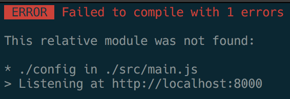
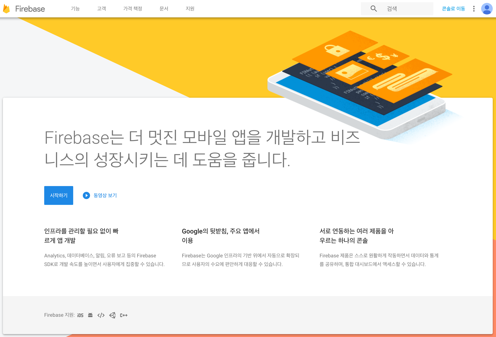
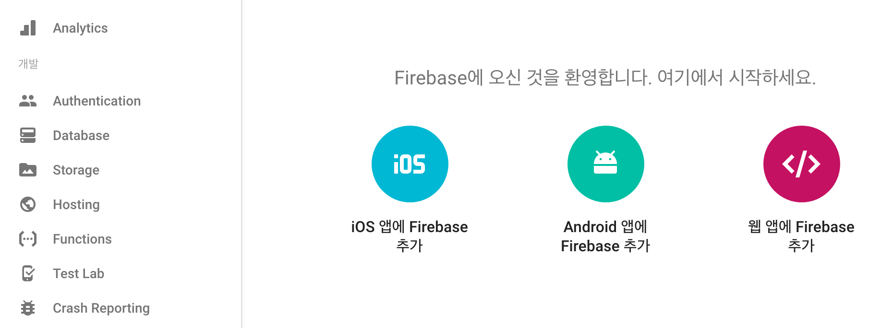
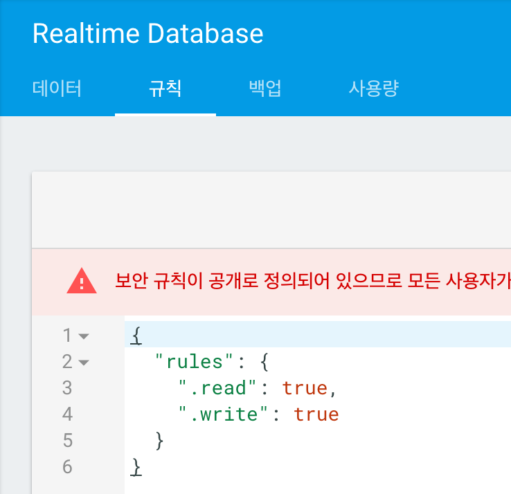
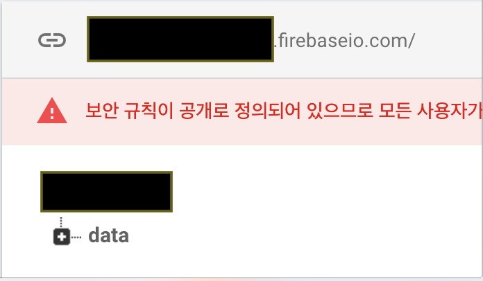
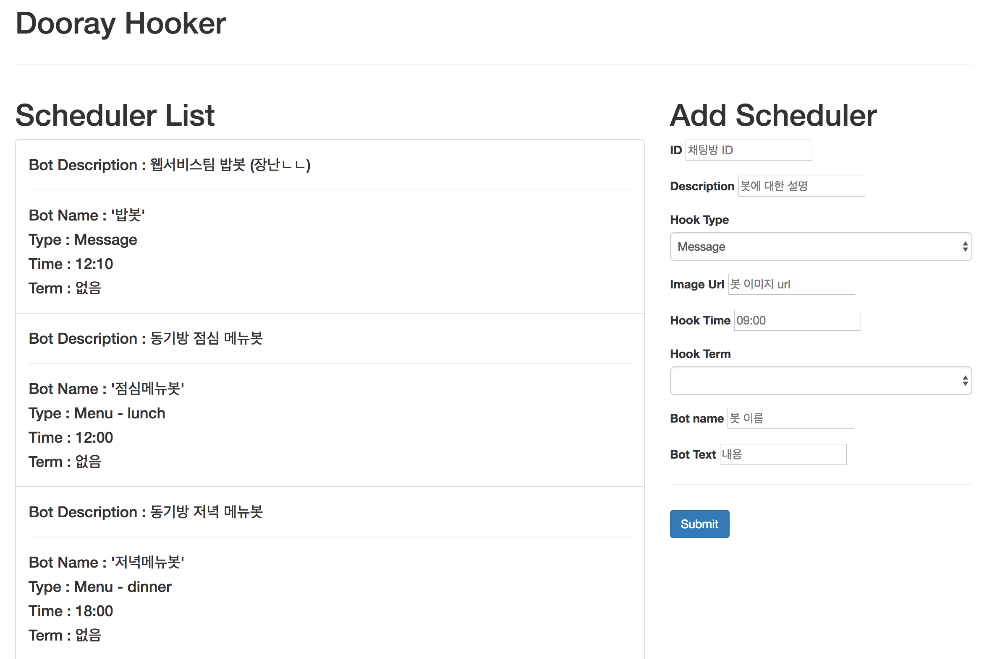
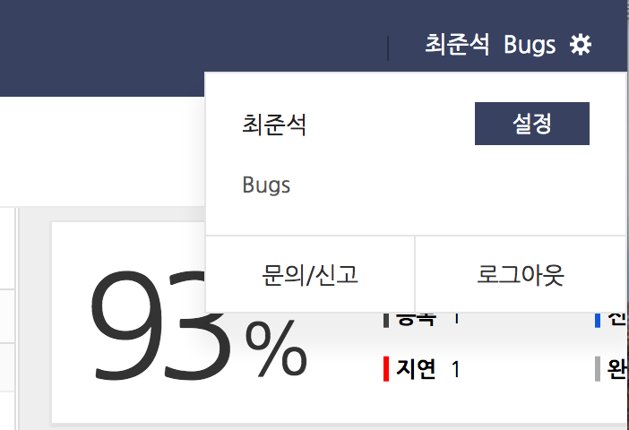
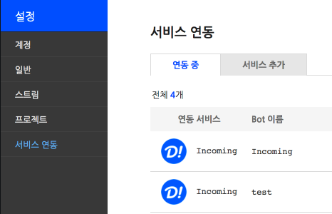

### !!! 이 글은 사내 메신저인 Dooray에서 활용할 bot scheduler에 대한 소개로, 비정상적인 경로로의 접근은 하지 말아주시기 바랍니다. !!!

---

사내 메신저인 Dooray의 메뉴봇과 스케쥴러를 만들어서 공유드립니다.
(매주 메뉴 이미지 1번을 넣어야 되는 귀찮음을 제외하고는 정말 편합니다.)

---

사실 `"git repository를 드리고 끝!! README를 보세요!!"` 할 수 있지만, 설정하는 방법이 조금... 까다롭습니다.
그래서 `README`를 어떻게 정리하면서 생각해보면서 내용을 공유해보고자 작성하게 되었습니다.

# 1. [Dooray Hooker Front](https://github.com/jicjjang/DoorayHookerFront)

## 1-1. 설정 파일

Front 페이지로, vue를 사용해 만들었습니다. 딱히 서비스를 할 생각 없이 개인 자리에서 돌리는 서비스이기 때문에

```bash
$ git clone https://github.com/jicjjang/DoorayHookerFront
$ cd DoorayHookerFront
$ npm install
$ npm run dev
```

명령어로 간단하게 npm을 설치하고 서버를 띄워줍니다.
그러면 바로



이런 에러가 발생합니다. 에러 내용대로 `src/config.js` 파일을 만들어줍니다. 이 때 참고해야 할 `ex.config.js` 파일이 있습니다.

```javascript
export const FIREBASE_URL = 'FIREBASE_URL';
```

firebase url은 스케쥴러가 돌면서 메세지를 보낼 데이터를 저장하기 위해 사용됩니다.

## 1-2. firebase 설정

우선 [https://firebase.google.com/](https://firebase.google.com/) 로 이동합니다.



로그인 후, 오른쪽 상단의 `"콘솔로 이동"` 버튼을 이용해 콘솔로 들어갑니다.


콘솔로 이동하시면 프로젝트들이 나옵니다. 여기서 프로젝트를 하나 추가해줍니다.
빈칸을 채워 앱을 만들면 아래 이미지와 같은 화면이 뜨는데, 이 동그란 세개의 버튼은 firebase로 서버 자체를 대체하는 앱을 만들 때 사용합니다.
하지만 저희는 DB만 사용할 예정이니 신경쓰지 마시고, 왼쪽 리스트 중 `"Database"`를 선택합니다.



먼저 `"Database"`의 Rule을 정해봅시다. 이 DB에 접근할 수 있는 권한을 부여한다면, 접근할 수 있는 인증이 필요합니다.
현재는 인증에 대한 기능은 없기 때문에 read, write를 true로 줬습니다.



이제 마지막으로 `"데이터"` 탭으로 갑니다. 이 부분에 url이 있습니다. `https://xxxxxxx.firebaseio.com` 과 같은 url을 복사합니다.



그리고 우리의 목표인 src/config.js 파일을 채웁니다.

```javascript
// ~~~.com/ 과 같이 제일 마지막에 '/' 는 포함시키지 마세요.
export const FIREBASE_URL = 'https://xxxxxxx.firebaseio.com';
```

## 1-3. 사용 방법

처음 실행해주셨던

```bash
$ npm run dev
```

명령어를 다시 실행합니다. (서버를 끄지 않으셨다면 자동으로 리프레시가 되어있을 겁니다.)
그러면 아래와 같은 화면에 Scheduler List만 없이 나올것입니다. 이제 스케쥴을 등록해주시면 됩니다!



### 1-3-1. ID

봇에 관심을 두셨던 분들이라면 다 알만한 내용입니다.
봇으로 메세지를 보내려면 채팅방의 id가 필요하겠죠??

아래 이미지처럼 [두레이](https://nhnent.dooray.com) 사이트에서 설정 탭으로 들어갑니다.



그리고 `"서비스 연동"`에서 서비스를 추가합니다. 추가 후 나오는 url을 복사해야 하는데, 이 url이 바로 ID가 됩니다!



### 1-4. 사용

1-3-1 에서 구한 ID (url)를 `Add Scheduler`의 ID에 입력해줍니다. 나머지는 원하시는대로 빈칸을 채워주시면 됩니다. (등록된 스케쥴을 클릭하여 수정 및 삭제 가능합니다.)

`Description`: 메세지 보낼 때 사용되지는 않습니다. Scheduler List를 공유하는 인원들이 알아볼 수 있도록 쓰는 설명입니다.
`Hook Type`: 메세지와 메뉴를 선택할 수 있습니다. 메뉴 선택 시 점심과 저녁을 추가적으로 고를 수 있습니다.
`Image Url`: 봇의 이미지입니다. (직접 업로드는 불가능합니다 ㅠㅠ)
`Hook Time`: 메세지를 보낼 시간입니다. `"24:00"`과 같이 입력해주세요. (아래에서 설명드릴 서버 코드를 확인해주시면 19:00 이후 ~ 익일 10:00 까지는 퇴근 시간으로 제외되어 있습니다.)
`Hook Term`: 특정 시간마다 반복되는 동작을 할 수 있습니다. (5분 간격, 10분 간격...)
`Bot Name`: 봇의 이름입니다.
`Bot Text`: 봇의 메세지 내용입니다. (Hook Type을 메뉴로 하셔도 메세지가 보내집니다.)

---

쓰다보니 내용이 길어졌네요... 이제 봇을 만들고 관리하는 Front 페이지에 대한 설명이 끝났습니다.
서버에 대한 내용은 다른 게시물에 따로 게시하겠습니다.

감사합니다.
