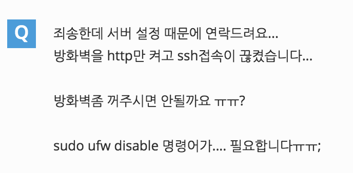
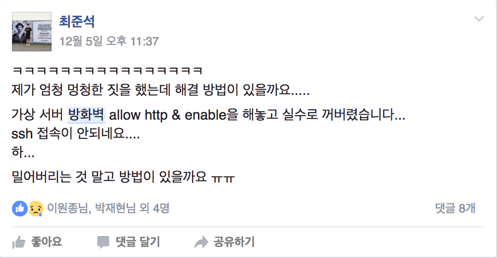
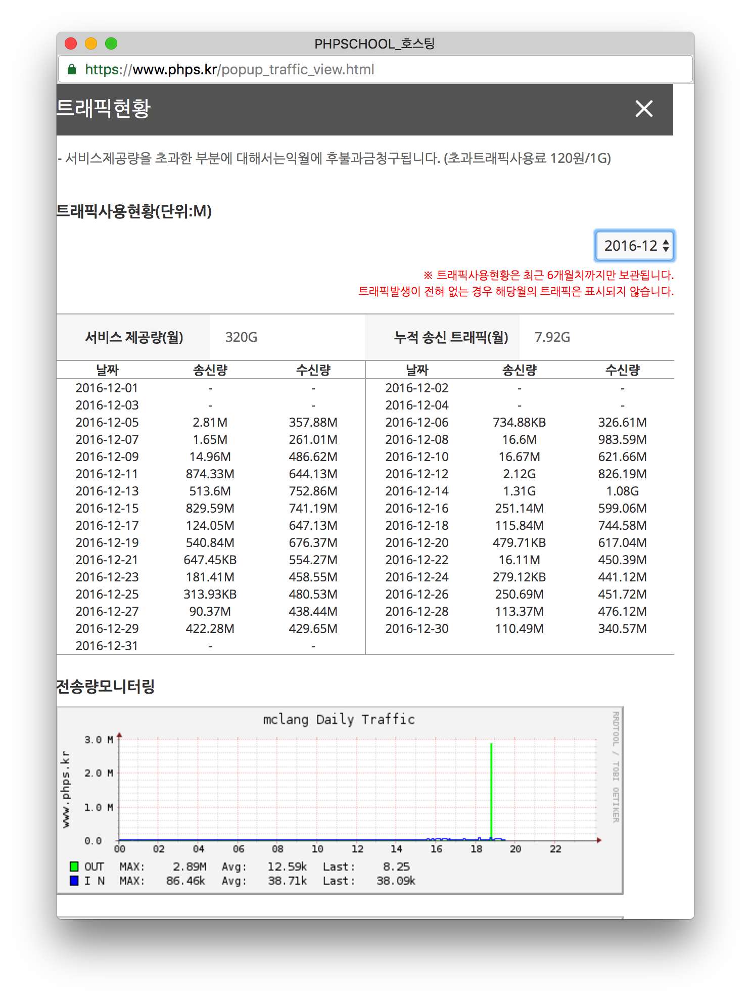

이번 포스트는 `첫 React 프로젝트(1)`에 이은 두번째 포스팅이지만 카테고리가 etc에 들어가게 되었습니다. 주제가 React 자체는 아니고... 바로 `Django & React 서버 세팅` 이기 때문이죠.

우선 Front의 배포는 처음이었고, Django의 배포는 두번째였지만, 익숙하지 않았습니다.


## 1. 서버 구매

애초에 카드 등록을 하는 아마존이나 heroku와 같은 부분은 고려하지 않았기 때문에 디자이너와 협의 후 바로 서버 호스팅을 구매하기로 했습니다.

예전에도 사용했었던 phpschool을 이용하기로 했고, 도메인은 일단 건너뛰기로 결정했습니다. 가상 서버 호스팅을 구매하고 기본적인 서버 세팅을 시작했습니다.

## 2. 서버 세팅

지난 번 구매했던 서버에서 문제는 `방화벽 설정` 이슈가 컸었습니다. 가장 먼저 방화벽을 설정했습니다. 그런데... ssh 접속 포트인 22번 포트를 allow 하지 않고(...) 방화벽 실행 & 서버 닫아버림. ...ㅋ 네 접속이 안되네요 ㅋㅋㅋ

새벽 1~2시에 phpschool에 글을 남겨서 `"죄송한데... 방화벽좀 꺼주세요..."` 글을 남기고 겨우 접속할 수 있었습니다.




방화벽 뿐만 아니라 서버 실행을 위한 nginx, uwsgi 서버 라이브러리들과 React, Django 같은 프레임워크 & 라이브러리들 설치하였습니다.

## 3. 백엔드 배포

기본적인 django, nginx, uwsgi설치를 하는데 nginx는 분명히 맞는데...! uwsgi가 계속 실행이 되지 않았습니다. 이 부분에서 제일 많이 헤맨것 같습니다.

### 3-1. uwsgi

결론부터 말하자면 pip로 설치하지 않고 apt-get으로 (서버는 ubuntu 환경입니다.) 설치했습니다. pip로 설치한 후 환경설정은 인터넷에 나오는 블로그 글들과 차이점들이 있었고, 자세하지 않았습니다. 그래서 pip 설치를 과감히 제거했습니다.

이 부분에서 무엇이 문제인지 찾는데 2~3일은 버린 것 같습니다. apt-get으로 설치하면 /etc/uwsgi 경로가 생기며 바로 설정파일을 넣으면 적용되는 폴더와 간단히 예제까지 생기는데 pip로 설치하면 폴더도 생기지 않고, (apt-get과 마찬가지 경로의) 디렉토리 및 파일을 직접 만들어서 넣어도 적용이 되지 않았습니다. (제 경험이므로 사람마다 차이가 있을 순 있겠네요.)

이 부분을 해결하다 uwsgi-emperor 기능도 찾았지만, 나중에 근본 원인을 찾은 후, 제거했고, (설정파일 하나로 여러 uwsgi 프로젝트를 컨트롤할 수 있도록 도와주는 기능입니다. 그래서 황제...!)

이 부분을 해결하기위해 헤매면서 `/etc/rc.local` 파일에 설정을 직접 넣기도 했었습니다. (이 파일은 적혀있는 스크립트는 시스템 재부팅마다 실행됩니다.)

그래도 결국 해결을 했고, emperor 모드를 버렸기 때문에, uwsgi 프로젝트를 추가한다고 하면 추가적인 설정이 필요하겠죠?

### 3-2. nginx

nginx는 간단합니다. 아래와 같은 설정 파일로 서버에 request가 들어오면 upstream에 있는 프록시로 요청을 보냅니다.

```sh
# uwsgi_pass mapper
upstream django {
#       server unix:///YOUR_DJANGO_CODE_IN_SOCK_FILE_PATH/mclang.sock;
        server 127.0.0.1:1111;
}

server {
    listen      PORT;
    server_name YOUR_IP # substitute your machine's IP address
    charset     utf-8;

    # max upload size
    client_max_body_size 75M;   # adjust to taste

    location /static {
        alias /PATH/collect_static;
    }

    location /uploads {
        alias /PATH/uploaded_files;
    }

    # /static, /uploads 를 제외한 모든 요청은 이제 아래 설정된 django로 보내게 된다.
    location / {
        uwsgi_pass      django;
        include         /etc/nginx/uwsgi_params;
    }
}
```

upstream의 1111포트는 uwsgi 설정 파일에 지정한 port랑 똑같아야 합니다.

```sh
#mclang.ini
[uwsgi]

# django 프로젝트 경로를 적어줍니다.
chdir           = YOUR_DJANGO_CODE_PATH
module          = mclang.wsgi
master          = true
plugin          = python3
# maximum number of worker processes
processes       = 10
# the socket (use the full path to be safe
# socket          = YOUR_DJANGO_CODE_PATH/mclang.sock
socket          = 127.0.0.1:1111
# ... with appropriate permissions - may be needed
chmod-socket    = 777
# clear environment on exit
vacuum          = true
wsgi-file=YOUR_DJANGO_CODE_PATH/mclang/wsgi.py
```

중간에 보이는 socket 주석은 sock 파일 경로입니다. socket은 url로 해도, 파일 자체를 가리켜도 무방한데 저는 url 경로로 작업했습니다.

### 3-3. django 코드

django 코드를 서버로 배포하기 위해 ftp를 이용하자!

는 생각따윈 버리고요... 마감이 일주일도 안남은 촉박한 타이밍이었지만! 프론트 배포 따위 생각해본 적도 없지만! 배포코드를 직접 만들어보기로 결심했습니다. python 배포 라이브러리인 `fabric`을 찾았고, 바로 시작했습니다.

```python
@task
def backend_master_deploy():
    """
    -  Deploy all files. Include source files, image files.
    """
    build_path = fabric_config.fabric_server_backend_project_name() + "_" + str(datetime.now().strftime("%Y%m%d%H%M"))
    server = fabric_config.fabric_server_backend_path() + "/" + build_path
    lnServer = fabric_config.fabric_server_backend_path() + "/" + fabric_config.fabric_server_backend_project_name()

    if confirm("continue master deploy?"):
        run("uname -s")
        run("rm -rf " + lnServer)
        run("mkdir -p " + server)
        run("ln -s " + server + " " + lnServer)

        _source_deploy_backend_uploader()

        run("rm -rf " + fabric_config.fabric_server_backend_path() + "/mclang_conf/uploaded_files")
        run("rm -rf " + server + "/uploaded_files")
        _image_deploy_uploader()
        run("ln -s " + fabric_config.fabric_server_backend_path() + "/mclang_conf/uploaded_files " +
            lnServer + "/uploaded_files")
        run("rm -rf " + lnServer + "/conf/settings.py " + lnServer + "/conf/settings.pyc")
        run("ln -s " + fabric_config.fabric_server_backend_path() + "/mclang_conf/settings.py " + lnServer + "/conf/settings.py")

        with cd(server):
            run("python3 manage.py collectstatic")
        run("service nginx restart")
        run("service uwsgi restart")
```

경로나 id, password는 보안 문제 + 귀찮기 때문에(...) conf파일로 따로 빼놓고, 서버와 로컬을 다르게 동작하도록 해놨습니다.

또한, 이미지 배포에 매우 많은 시간을 잡아먹었습니다. (디자이너의 작품을 만드는 것이기 때문에 이미지가 매우 용량이 컸던 점을 [앞 포스팅](/posts/first-react-project-1/){:target="\_blank"}에서 말씀드렸었죠)

그래서 master_deploy 말고도 source_deploy, image_deploy를 따로 만들어서 배포를 했습니다.

## 4. 프론트엔드 배포

gulp나 grunt등을 찾아다가 문득 생각을 해보니, 어라... fabric으로 하면 안될 이유가 없잖아...? ㅋㅋㅋㅋㅋ
바로 프론트 배포 코드도 작성했습니다.

백엔드는 source + image라면 프론트엔드는 source + package install(npm install) 두 경우를 고려해야했고, package 설치가 매우 느렸기 때문에 master를 두 경우로 나눠서 다시 만들었습니다.

```python
@task
def frontend_master_deploy():
    """
    -  React code and package Deployment.
    """
    build_path = fabric_config.fabric_server_frontend_project_name() + "_" + str(datetime.now().strftime("%Y%m%d%H%M"))
    lnLocal = fabric_config.fabric_local_frontend_path() + "/" + fabric_config.fabric_local_frontend_project_name()
    server = fabric_config.fabric_server_frontend_path() + "/" + build_path
    lnServer = fabric_config.fabric_server_frontend_path() + "/" + fabric_config.fabric_server_frontend_project_name()

    if confirm("continue front code deploy?"):
        local("rm -rf " + lnLocal + "/build")
        with lcd(lnLocal):
            local("npm run build")
        run("uname -s")
        run("rm -rf " + lnServer)
        run("mkdir -p " + server)
        run("ln -s " + server + " " + lnServer)
        _source_deploy_frontend_uploader()

        run("rm -rf " + fabric_config.fabric_server_frontend_path() + "/mclang_conf/node_modules " +
            fabric_config.fabric_server_frontend_path() + "/mclang_conf/package.json")
        _package_deploy_uploader()
        with cd(fabric_config.fabric_server_frontend_path() + "/mclang_conf"):
            run("npm install --production")
        run("ln -s " + fabric_config.fabric_server_frontend_path() + "/mclang_conf/node_modules " +
            lnServer + "/node_modules")
        run("service nginx restart")
```

---

이렇게 설정과 배포를 끝마치고 개발을 끝내게 되었죠.

사실 끝은 아닙니다... 디자이너가 전시회를 하는 동안 발생하는 오류와 트래픽 (이미지 덕분에 걱정이...) 주시를 시작했지만 어느 정도 안정됨을 확인하고 끝내게 되었죠.




안정적인 error_log와 전시 DP일, 시작일 등에 트래픽이 몰린 모습입니다. (트래픽은 대부분 이미지...)

---

진짜로 끝입니다. 다 쓰고보니 React가 중점이 아닌 배포와 세팅이 주가 된 이야기였네요 ㅠㅠ... (시간은 프론트엔드 개발이 훠얼씬 들어갔습니다.)

어쨌든! 힘겹게 개발과 세팅을 마쳤습니다. 디자이너와의 일정, 개발, 회의 등등... 하지만 일을하면서 하는 프로젝트는 엄청난 뿌듯함이!!! 언제든 시간이 된다면 환영하며 프로젝트를 다시 하고 싶어요 :D

이렇게 11월 2일 ~ 12월 11일 까지의 프로젝트 경험기를 마무리하도록 하겠습니다. 긴 글 읽어주셔서 감사합니다.
