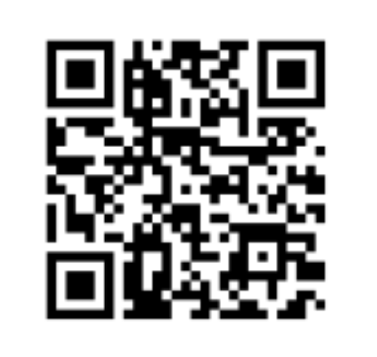
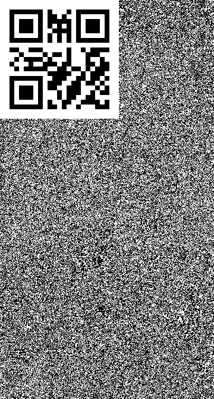
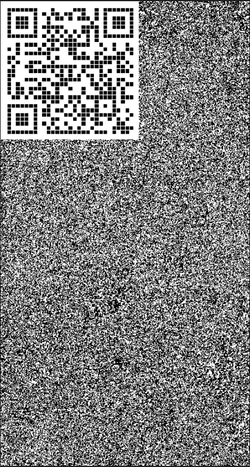
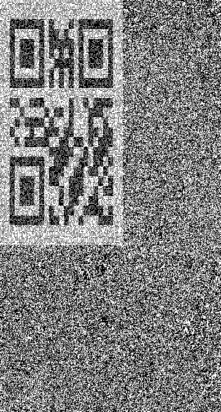

- 무슨 기술인가
    - 사실 별거 없음
    - 그리고 누군가 만들어 놓은 코드가 있음 ⇒ https://github.com/redris96/QRHide
        - 바꾼 코드가 사실상 없으나, 우리 서비스에 사용할수도 있고 활용할 영역이 많아보이는 기술이라 공유
    - 지인이 일하는 회사 웹툰 서비스에서 `이미지 내 qrcode가 숨겨져 있다!` 라는 말을 듣고 파보기 시작
    - Base Image에 QR Code를 숨기는 작업을 해야됨

### Base image


### QR Code



# 방법

- Base Image + QR Code를 더해서 인코딩을 함
- 인코딩 결과물을 디코딩 해보면 QR Code가 노출됨
- 이러한 기능이 필요한 이유 / 어디에 적용할 수 있을까
    - 불펌된 이미지의 히스토리를 추적할 수 있음
        - 당연히!!! 화면 캡쳐해서 퍼가도 이미지 자체 pixel에 인코딩이 되어있기 때문에 QR Code도 딸려감
        - ~~QR Code에 현재 로그인한 유저의 ID와 같은 식별값을 심을 수 있고, 불펌된 이미지를 찾아서 이를 바탕으로 💸💸💸 **고 소 미** 💸💸💸 가능!!! ㅋㅋㅋ~~
    - 이런 기능을 미리 알았더라면 모먼티카 서비스에서 테이크마다 심어서 불펌을 체크할 수 있지 않았을까!!!
        - 물론 이제 시작할 스타크로니클, 버디에도 적용 가능
    - 심지어 코드가 어렵지도 않음!!

# Encode 개발 코드

```python
# encode.py
from PIL import Image
import sys

base_image = Image.open('./image.png')
loaded_base_image = base_image.load()
qr_image = Image.open('./code.png')
loaded_qr_image = qr_image.load()


if base_image.size < qr_image.size:
	print("QR Code 이미지의 크기는 Base 이미지의 크기보다 작아야 합니다.")
	sys.exit()


print('0000', base_image.size)
# 0000 (360, 672)
print('1111', qr_image.size)
# 1111 (200, 200)
print('2222', loaded_qr_image[0, 1], loaded_qr_image[0, 1][0])
# 2222 (255, 255, 255, 255) 255
print('3333', loaded_base_image[0, 1], sum(loaded_base_image[0, 1]))
# 3333 (226, 231, 227, 255), 939


# qr code image width/height 만큼 이중 for문을 돌음. x, y 좌표 한픽셀씩 돌아가겠다는 의미
for x in range(qr_image.size[0]):
	for y in range(qr_image.size[1]):
		base_image_pixel = loaded_base_image[x, y] # base image의 한 픽셀
		change = False

		# qr code image	는 흑/백만 있는 것으로 합니다. (이 말은 색이 포함된 qr code는 사용 X)
		# loaded_qr_image[x, y]는 한 픽셀의 컬러값. 0번째 요소는 RGB의 R을 나타냄
		if loaded_qr_image[x, y][0]:
			# R 값이 True이면 넘어옴. 흑/백이므로 0 or 255인데, 0일땐 False
			# base_image_pixel의 sum은 R, G, B 색상 모두를 더한 값
			# base_image_pixel의 sum % 2는 0, 1이 나올 수 있고,
			# 이는 흑 백을 나누기 위해 체크를 함
			# if loaded_qr_image[x, y][0]: => 현재 QR이 흰색일 때의 케이스
			if sum(base_image_pixel) % 2:
				# RGB 합산의 mod 2는 0일때 흑, 1일때 백 임을 나타냄
				# mod 연산 후 1일때 True
				# QR이 백 인데 Base 이미지 같은 위치 픽셀이 mod 연산 시 1(255, 백)인 케이스 => 넘어감
				continue
			else:
				# QR이 백 인데 Base 이미지 같은 위치 픽셀이 mod 연산 시 0(0, 흑)인 케이스 => 변경
				change = True
		else:
			# :else => 현재 QR이 검은색일 때의 케이스
			if sum(base_image_pixel) % 2:
				# QR이 흑 인데 Base 이미지 같은 위치 픽셀이 mod 연산 시 1(255, 백)인 케이스 => 변경
				change = True
			else:
				# QR이 흑 인데 Base 이미지 같은 위치 픽셀이 mod 연산 시 0(0, 흑)인 케이스 => 넘어감
				continue
		if change:
			# change가 True일 때, R 값을 1만 낮춤
			# 1만 변경해주면 색상에 크게 영향이 가지 않음
			# 추후 decoding 시, mod 연산으로 흑백 픽셀만 찍히게 작업한다면?
			# QR 코드 영역은 제대로 나오게 됨
			loaded_base_image[x, y] = (base_image_pixel[0] - 1, base_image_pixel[1], base_image_pixel[2])

base_image.save('encoded_image.png')
```

# decode 개발 코드

```python
# decode.py
from PIL import Image

encode_base_image = Image.open('encoded_image.png')
loaded_encode_base_image = encode_base_image.load()

# encode image width/height 만큼 이중 for문을 돌음. x, y 좌표 한픽셀씩 돌아가겠다는 의미
for x in range(encode_base_image.size[0]):
	for y in range(encode_base_image.size[1]):
		if sum(loaded_encode_base_image[x, y]) % 2:
			# encode때 했던 mod 연산을 동일하게 처리
			# mod 연산 시 1 => 흰색으로 변환
			loaded_encode_base_image[x, y] = (255, 255, 255)
		else:
			# mod 연산 시 0 => 검은색으로 변환
			loaded_encode_base_image[x, y] = (0, 0, 0)

encode_base_image.save('decoded_image.png')
```

# 결과물

- Base Image + QR Code를 더해서 인코딩을 함
- 인코딩 결과물을 디코딩 해보면 QR Code가 노출됨

### Encode image


### Decode image



### 주의할 점

- QR Code 이미지의 한 픽셀, 한 픽셀을 잘라서 Base image에 넣는 작업을 거치기 때문에 QR Code의 해상도가 낮으면 결과물이 만족스럽지 않을 수 있음
    - 하지만, 개인정보가 포함된 qr을 넣으려면 서버 사이드에서 프론트 화면 렌더링 시, 이미지를 생성해야 하므로 깨질일은 거의 없을듯 하다~





- R 값을 1 낮추는 방식으로 진행했는데, 케이스에 따라 G, B 값을 변경시키거나, 1이 아닌 더 큰 값으로 변경시킬 수 있을 것 같음. 하지만 갭이 커질수록 열화현상이 발생할 수 있으니 주의해야 한다.
    - 아래 `R -5 ~ R -20 이미지 참고`
    - 왼쪽 위 상단 부분의 색상 변화가 갈수록 눈에 띄게 커짐

### R -5


### R -10


### R -15


### R -20


# 실제 서비스의 적용

- 당연히 모든 QR Code를 숨긴 이미지가 동일하게 숨긴다면 개발을 할 줄 아는 사람이 decode 코드를 짤 수 있음!
- QR Code를 조작하는 방식으로 진행
    - QR Code 픽셀별로 R, G, B의 컬러값을 다르게 바꾼다던지
        - 홀수 픽셀은 G 값 변경, 짝수 픽셀은 R값 변경 등등…
- 해독하는 decode 코드는 우리만 아는 방식으로, 우리만 알아볼 수 있게 해두면 됨
- 예를 들어 QR Code를 y축 기준 2배 늘리면 어떻게 될까?

### QR Code를 Y축 2배 늘린 Encode image


### QR Code를 Y축 2배 늘린 Decode image



이렇듯, QR Code의 픽셀들을 decode 했을 때 우리만 알아볼 수 있도록 난독화를 해줘야 함. 위의 이미지는 예시지만 쉽게 알아볼 수 있으면 안됨