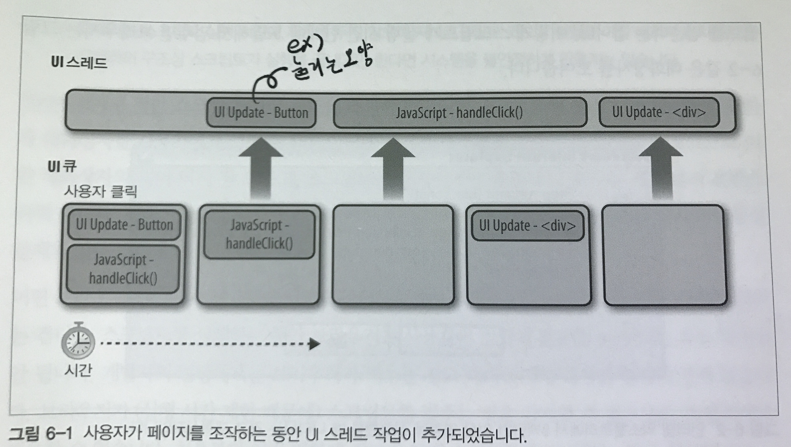

오늘 새벽까지 javascript optimize 4 게시글을 작성했었는데요, 이전 파트에서 말씀드린대로
정규표현식에 대한 5장은 스킵하고 6장으로 시작해보겠습니다.

## 6. 응답성 좋은 인터페이스

1장에서 브라우저 UI 스레드에 대해 아주 간단히 알아보았습니다. 즉, UI 업데이트 후 자바스크립트를 실행해야하는데
동시에 실행할 순 없으므로 적절한 배치가 필요합니다.

### 6-1. 브라우저 UI 스레드

브라우저에서 보통 `스레드`라는 단어를 사용하진 않지만, UI 업데이트 및 javascript가 공유하는 프로세스를
UI 스레드라고 합니다. 보통 유휴상태가 될 때까지 할 일을 대기시키는 큐 역할을 합니다.

```javascript
function handleClick() {
  var div = document.createElement('div');
  div.innerHTML = 'Clicked!';
  document.body.appendChild(div);
}
```

코드의 마지막 줄에서 appendChild 메서드가 실행되면 UI를 수정하도록 UI 업데이트를 큐에 추가합니다.
정확히 말하자면



이미지와 같이

1. 눌리는 모양으로 ui가 업데이트
2. handleClick 실행
3. ui 업데이트

순서대로 UI 스레드가 진행됩니다.

---

브라우저는 javascript를 일정 시간 이상 허용하지 않습니다. 그렇기 때문에 너무 많거나, 많이 반복되거나, 무한 루프에 빠진다면
에러를 보게 되는데요, 이 에러는 브라우저마다 상이하고, 시간 또한 다릅니다.

javascript를 만든 Brendan Eich가 한 말로 `"자바스크립트가 1초 이상 실행된다면 아마도 그 코드는 잘못된 것이다."` 라는 말이 있다고 합니다...

### 6-2. 타이머 다루기

보통 타이머는 setTimeout이나 setInterval을 이용합니다. 그러면 javascript 엔진은 일정 시간동안 대기했다가 UI 큐에 작업을 추가합니다.
그 말은 즉

```javascript
function greeting() {
  alert('hahahahaha');
}

setTimeout(greeting, 250);
```

이라는 코드가 있으면 greeting 메서드를 250ms 뒤에 실행하는 것이 아니라, 250ms 뒤에 UI 큐에 추가한다는 것입니다.
정확히 언제 실행이 될 지는 알 수 없습니다.
(setInterval은 UI큐에 있는 작업이 아직 실행되지 않았다면 다시 UI 큐에 동일한 작업을 추가하지 않습니다.)

```javascript
var button = document.getElementById('id');
button.onclick = function() {
  oneMethod();

  setTimeout(function() {
    // blahblah...
  }, 500);

  twoMethod();
};
```

이 코드에서 만약 twoMethod 실행이 500ms 이상 걸린다면, twoMethod가 끝나기 전에 타이머 코드가 UI 큐에 등록됩니다.

---

타이머 정확도에 대한 얘기를 해보자면, 윈도우 OS는 타이머를 15ms 단위로 갱신합니다.
그리고 브라우저 대부분이 타이머 지연시간이 10ms 입니다.

그래서 둘을 합친 25ms를 타이머 지연 최소시간으로 해놓으면 브라우저 및 타 OS에서 타이머에 관한 문제를 예방할 수 있습니다.

---

코드를 한 타이밍에 한번만 처리하는 것은 비효율적일 때가 있습니다. 만약 1000개의 배열 항목에 지연시간 25ms, 처리시간 1ms라면
(25ms + 1ms) \* 1000 = 26000ms = 25s 입니다. 항목을 50개씩 묶어서 처리(너무 많이 묶는것도 비효율적일 수 있습니다.)
할 수도 있습니다.

---

타이머의 성능 문제는 타이머를 동시에 여러 개를 사용하면서 발생합니다. 모든 타이머가 실행 시간을 얻기 위해 경쟁하기 때문에
너무 짧은 타이머 지연시간을 여러개 선언해 놓는 것은 병목현상이 발생하기 쉽습니다. 차라리 위에 말씀드린 것처럼 느린 주기에
한꺼번에 여러 일을 실행하는 것이 훨씬 효율적입니다.

### 6-3. 웹 워커

브라우저 UI 스레드 밖에서 동작할 인터페이스의 필요성으로 만들어 진 것이 웹 워커입니다. 그래서 워커가 생성될 때마다 javascript를
실행할 고유 스레드(브라우저 UI 스레드에 영향을 끼치지 않음)를 생성하기 때문에 성능 향상에 도움일 될 수 있습니다.

단점은 UI 스레드에 묶이지 않기 때문에 브라우저의 자원 대부분에 접근하지 못하고,
스레드 바깥에서 DOM을 변경하기 때문에 문제가 발생하기 쉽다는 점입니다.

웹 워커는

1. navigator 객체
2. location 객체
3. self 객체
4. 모든 ECMA 객체 (Object, Array, Date...)
5. XMLHttpRequest
6. setTimeout, setInterval
7. close() (워커를 즉시 중단시킴)

와 같은 일부 기능만을 가집니다.

웹 워크를 실행하기 위해서는

```javascript
var worker = new Worker('code.js');
```

와 같이 실행하며, 실행이 된다면 지정한 파일에 대한 새로운 워커 환경(브라우저 UI 스레드와는 상관없는)을 가진
새 스레드를 생성합니다. 비동기적으로 파일을 내려받으며, 모두 내려받은 후 시작이 됩니다.

---

이벤트로 동작을 하는데 아래와 같은 이벤트로 통신을 하게 됩니다.

```javascript
// browser
var worker = new Worker('code.js');
worker.onmessage = function(event) {
  // 웹 워커에서 오는 정보를 받음
  alert(event.data);
};
worker.postMessage('testest'); // 웹 워커로 정보를 보냄
```

```javascript
// web worker
self.onmessage = function(event) {
  // 브라우저에서 오는 정보를 받음
  self.postMessage('hello!'); // 브라우저로 정보를 보냄
};
```

---

현실적으로 웹 워커를 사용하는 것은 브라우저 UI 스레드에 묶여있지 않고 순수한 데이터를 다루며,
실행에 아주 긴 시간이 걸리는 스크립트에 적합합니다.

---

사용자 경험 (UX)에 악영향을 줄 만큼 실행하면서 중요한 javascript 코드는 없습니다.
사용자 경험이 항상 최우선 되야 함을 주의해주세요!
