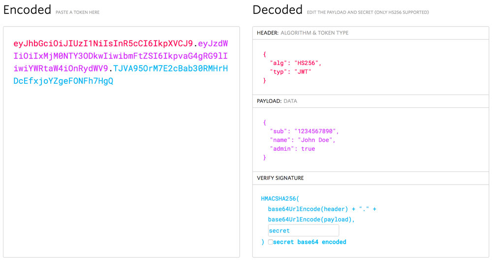
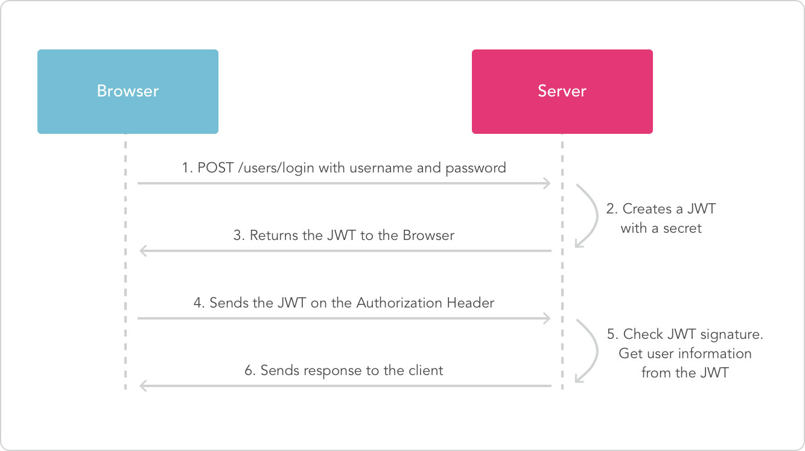

회사에서 서버 개발을 하면서 Session과 Cache이 복잡하게 얽혀있고, 분리된 여러 서버를 넘나들며
사용하기 힘들다는 생각을 하게되었습니다. 특히, 인증 부분에 있어서 맡아서 하는 부분이 없다보니
개발을 해볼 수 있는 환경이 아니었습니다. 그래서 우연히 알게 된 jwt에 대해 공부를 해보았습니다.

---

# 1. basic

JSON Web Token (JWT)는 디지털 서명을 통해 확인하고 신뢰할 수있는 정보를 보내는 데 사용됩니다.
가장 기본적인 형태의 JWT를 사용하면 서명으로 데이터 (Claim)에 서명 할 수 있으며 나중에
비밀 서명 키로 확인할 수 있습니다.

JWT는 base64url로 인코딩 된 값 3개를 마침표로 구분하여 표시합니다.



`(이 그림에서 나타나는 정보로 알 수 있는 것은 encrypt 된 값이 plain 값일 때의 정보들을 계속 가지고 있다는 점입니다. 그렇다면 DB에 질의를 하지 않고, 지속적으로 데이터를 가지고 있을 수 있다는 점을 알 수 있습니다.)`

이제 그림의 3가지 값에 대해 알아봅시다.

<span style="color:red; word-break: break-all;">
eyJ3eXBiOiJKV1QiDCJCgGciOiDIUcD1NiJ7
</span>.<span style="color:purple; word-break: break-all;">
cyJ3c2KySWEiOiIiMVdmONZwZj0zNWRhLTE4ZjItODZhYk1jZWYzOTD0NjBvYmWidJ
</span>.<span style="color:blue; word-break: break-all;">
-xN_h82PHVTCMA9vdoErcZxH-x5mb13y1f37t3rGzcM</span>

`.` 으로 합하여 놓은 `Header` / `Claim (Payload)` / `Signature` 입니다. 이제 하나씩 알아봅시다.

## Header

Header에는 JWT에 사용 된 해시 알고리즘과 토큰을 설명하는 간단한 JavaScript 객체의 인코딩 된
문자열 표현입니다.

## Claim (Payload)

토큰의 핵심으로 데이터를 저장합니다. Payload 길이는 JWT에 저장하는 데이터의 양에 비례하기 때문에
최소한의 데이터만 저장하길 권장합니다. (해시 값 자체는 길어지지만 Decrypt 하는 시간 또한 리소스입니다.)

또한, Claim은 다시 `reserved` / `public` / `private` 으로 나뉩니다.

### 1) reserved Claim

의무 사항은 아니지만 권장되는 (미리 정의 된) Claim 입니다.

- iss : 토큰 발급자
- exp : 만료 타임 스탬프 (초단위) (만료 된 토큰 거부)
- iat : JWT가 발행 된 시간. JWT의 나이를 결정하는 데 사용
- nbf : "not before"는 토큰이 활성화 될 미래의 시간
- jti : JWT의 고유 식별자. JWT가 재사용되거나 재생되는 것을 방지
- sub : 토큰의 대상 (드물게 사용됨)
- aud : 토큰의 대상 (거의 사용되지 않음)

### 2) public Claim

자유롭게 정의할 수 있습니다. 그러나 (충돌 방지 네임 스페이스가 포함된) URI로 정의되어야 합니다.

### 3) private Claim

사용자가 정의하는 Claim 입니다.

---

Claim은 아래와 같이 사용합니다.

```json
{
  "sub": "1234567890",
  "name": "JunSeok Choi",
  "admin": true
}
```

## Signature

Signature 에는 Header 와 Payload를 기반으로 생성한 서명값이 들어갑니다.

```javascript
HMACSHA256(base64UrlEncode(header) + '.' + base64UrlEncode(payload), secret);
```

# 2. Action

jwt가 실제로 브라우저와 서버 사이에서는 아래와 같이 동작합니다.



### 1) 사용자가 id, pw를 서버로 보내 로그인을 한다.

### 2) 서버에서 secret 키로 jwt 값을 만든다.

### 3) 브라우저로 jwt 값을 전송한다.

### 4) 브라우저에서 인증 헤더와 함께 jwt 값을 보낸다. (보낼 때 다른 값도 같이 보낼겁니다.)

### 5) 서버에서 jwt Signature 값을 체크하여 데이터를 조회한다.

### 6) 결과를 브라우저로 보낸다.

---

가장 고민했던 부분은 사실 토큰 탈취 시, 사용자 계정을 빼앗길지 아닐지에 대한 여부였습니다.
사용자마자 secret 키 값이 다르면 토큰을 탈취당해도 개개인마다의 secret 키가 다르니
jwt 해시가 되지 않을 줄 알았으나, 개개인이 아닌 App 마다의 secert 키가 있는 구조여서
기존 Session, Cookie를 사용할 때와 동일하게 토큰이 중요 이슈로 남아있게 되었습니다.

하지만 서버에 있는 secert값을 유추하기 힘들기 때문에 (거의 불가능) 보안적인 측면에서
안전할 것이라 여겨지며 기존 Session, Cookie 구조보다는 훨씬 가볍게 사용할 수 있을 것 같아
SPA 프로젝트에서 유용할 것으로 보여집니다.
