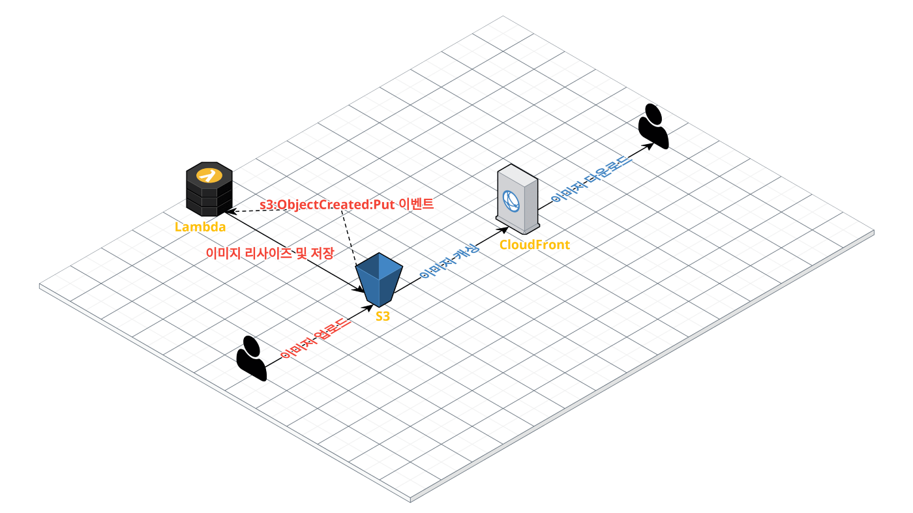
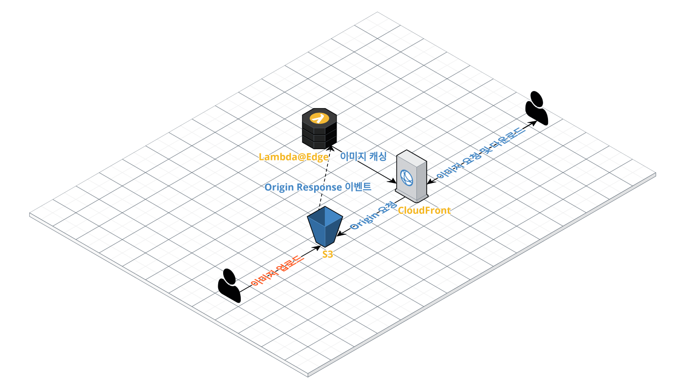
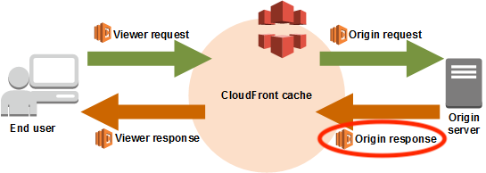
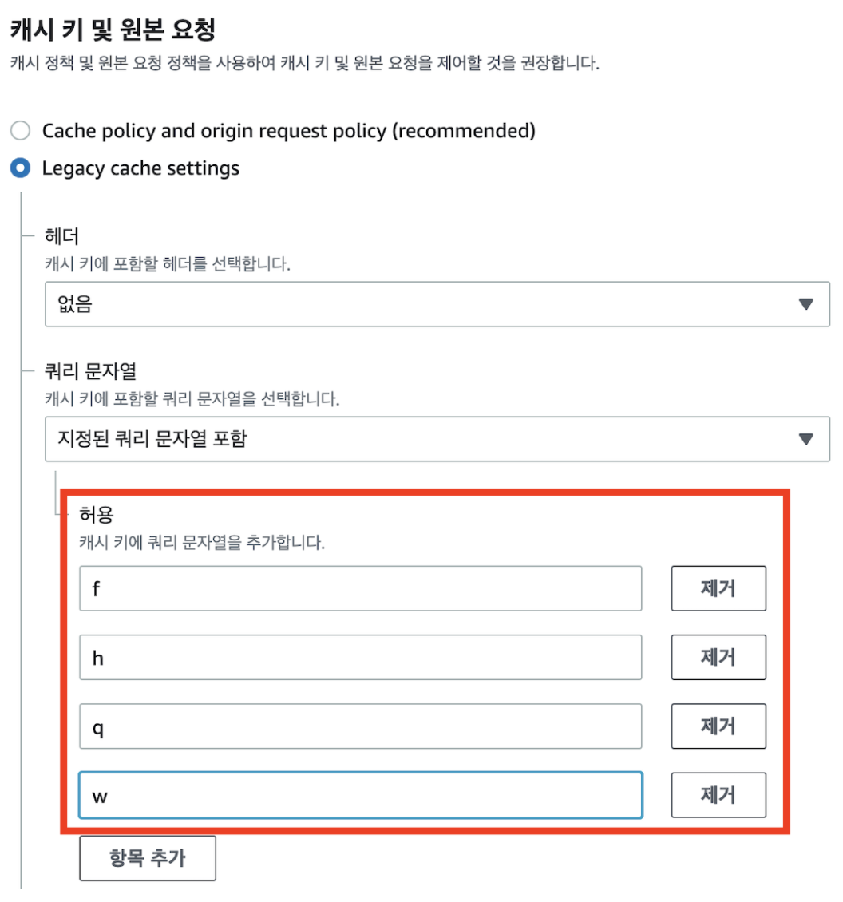
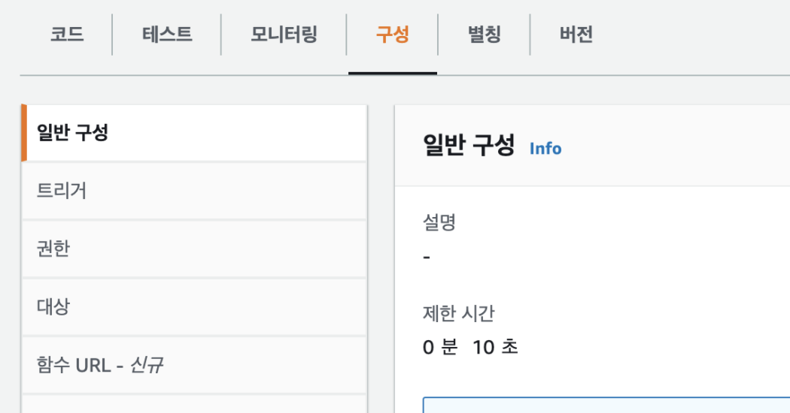
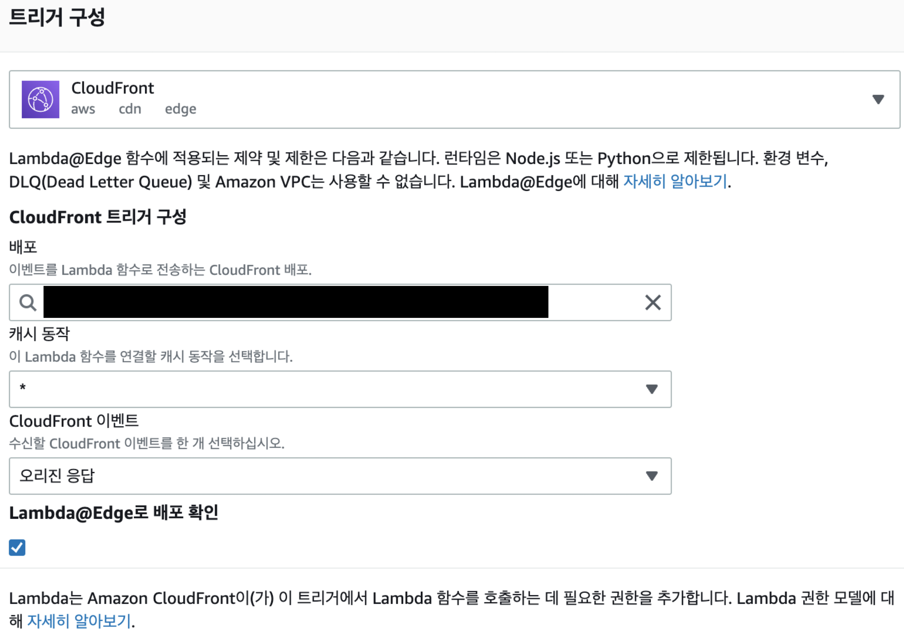
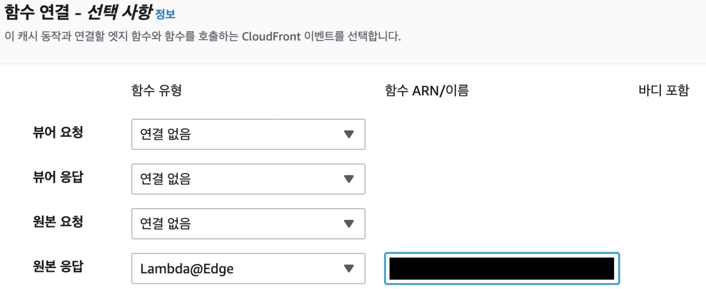
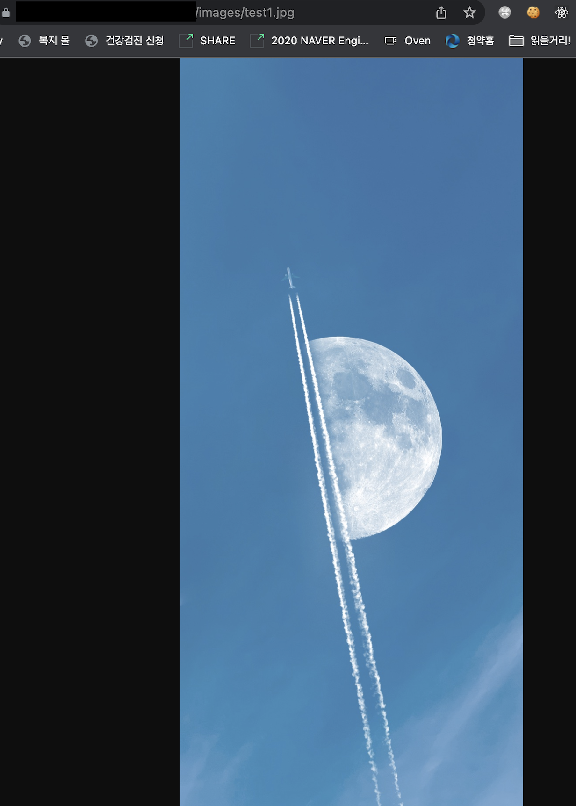
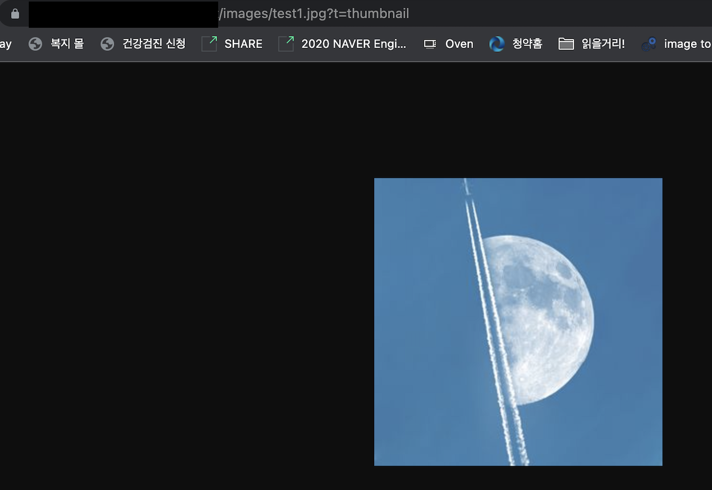

참고 ref1 - [AWS Lambda를 이용한 이미지 썸네일 생성 개발 후기](https://medium.com/daangn/aws-lambda%EB%A5%BC-%EC%9D%B4%EC%9A%A9%ED%95%9C-%EC%9D%B4%EB%AF%B8%EC%A7%80-%EC%8D%B8%EB%84%A4%EC%9D%BC-%EC%83%9D%EC%84%B1-%EA%B0%9C%EB%B0%9C-%ED%9B%84%EA%B8%B0-acc278d49980)
참고 ref2 - [AWS Lambda@Edge에서 실시간 이미지 리사이즈 & WebP 형식으로 변환](https://medium.com/daangn/lambda-edge%EB%A1%9C-%EA%B5%AC%ED%98%84%ED%95%98%EB%8A%94-on-the-fly-%EC%9D%B4%EB%AF%B8%EC%A7%80-%EB%A6%AC%EC%82%AC%EC%9D%B4%EC%A7%95-f4e5052d49f3)

---

사이드 프로젝트 팀에 합류하여 퇴근 후 프로젝트를 진행하고 있습니다.
flutter를 써보고자 들어간 팀인데 앱개발자 분들이 flutter를 이미 잘 만들고 계셔서 ㅠㅠ... 어쩔수 없이 프론트... 가 아닌 서버개발자(??)로 개발을 하고 있습니다.

회사 서비스를 만들면서 api서버는 건드리고 있으나, 실제 배포 프로세스나 microservice화 된 서비스들을 연결한다거나 api gateway, 권한 관리 등등에 대해 제대로 해본 경험이 없습니다. 그렇기에 걱정반 기대반으로 시작한 제 업무는 `이미지 업로드 시, thumbnail을 만들어야 하는데 당근의 lambda@edge아티클을 보고 thumbnail 생성을 구현해달라` 였습니다.

aws는 프리티어로 ec2에 서버를 돌려본 경험이 전부이지만 하나하나 다 물어보며 진행하기는 어려웠습니다.

---

## 업무 파악

당근의 아티클에는 기존 프로세스에 대한 아티클이 추가로 있었고, 어떤 방식에서 어떤 방식으로 수정하려고 한다~ 라는 히스토리를 알 수 있었습니다.

당근의 lambda를 이용한 thumbnail 생성은 아래와 같이 저장되고 있습니다.



client, server에서 s3 bucket에 이미지가 올라갈 때, 해당 lifecycle에 연결해둔 lambda를 이용해 이미지 resize를 하여 저장하는 방식입니다. 가장 쉽게 생각할 수 있는 방법이지만, 이를 이용하면 이미지 1장를 올릴 때, 이미지 n장이 저장되게 됩니다. cdn을 통해 캐시되긴 하지만, 트래픽이 많아지게 되는 상태에서 s3의 리소스를 과하게 많이 잡아먹게 되겠죠.

이후 lambda@edge에 대한 아티클을 읽어보았습니다.



이미지가 s3 bucket에 올라올 때가 아닌, 유저가 특정 이미지에 접근 할 때, cloudfront를 통해 s3에 접근하게 됩니다. 물론 hit를 한다면 s3에 들어오지 않겠죠. 그 순서는 아래와 같습니다.



cloudfront에 캐시가 되지 않아서 s3로 접근 후 response를 던져줄 때, origin에 대한 정보를 그대로 넘겨주는 것이 아니라, origin을 crop한 이미지의 정보를 넘겨주면 되는 것입니다. 그렇게 되면 crop된 이미지의 정보가 캐시될 것이고, 따로 s3의 저장공간을 사용하지 않더라도 cloudfront가 알아서 캐시해주게 되는 것입니다.

## 작업

### cloudfront



cloudfront를 통해 cdn을 하나 만들고, 쿼리문자열을 허용하게 해줍니다. format, quality, width, height 정보를 받아서 lambda 함수 동작 시, origin인지 crop이 필요한 요청인지를 구분할 수 있습니다.

### lambda

기본적으로 lambda@edge 구성을 하려면 region을 `us-east-1` 으로 설정해주어야 합니다. 다른 곳은 동작을 안하네요...



lambda 구성 시, 기본 timeout은 3초입니다. 하지만 첫 유저(다른 유저들은 캐시된 이미지를 보기 때문에 빠름)가 이미지에 접근하게 되면 croped image를 생성해야하는데, 3초안에는 이미지를 불러오고, crop하고, response를 다시 보내는데까지 시간이 부족합니다. 추후 lambda의 동작시간이 줄어든다면 테스트를 토해 보정할 수 있습니다.

### lambda 코드 작성

```js
// 슈도코드 입니다.
const AWS = require('aws-sdk'); // 로컬에서는 sam을 사용하기 때문에 설치 필요 없음. remote에서는 자동으로 들어감
const Sharp = require('sharp'); // image crop을 위해 사용

const S3 = new AWS.S3({
  region: 'us-east-1',
});
const BUCKET = 'YOUR_BUCKET_NAME';
const allowedExtension = ['jpg', 'jpeg', 'png'];

exports.lambdaHandler = async (event, _context, callback) => {
  let { request, response } = event.Records[0].cf;

  // 기본적으로 200이 아니면 s3에 이미지가 없는것임...
  if (parseInt(response.status, 10) !== 200) {
    return callback(null, response);
  }

  try {
    const extension = request.uri를 이용해 확장자를 얻어냄

    const params = request.querystring를 이용해 query param을 얻어냄

    if (!params.t || params.t !== 'A') { // cloudfront에서 설정한 t 값이 A가 아니라면 일반 요청이므로 바로 return
      return callback(null, response);
    }

    if (!allowedExtension.includes(extension)) { // 확장자가 지원을 하지 않는다면 그대로 return
      return callback(null, response);
    }

    const result = await S3.getObject({
      Bucket: BUCKET,
      Key: image path // image path에서 제일 앞글자의 '/'는 제외시켜야 한다.
    }).promise();

    if (result.ContentLength == 0) { // s3의 content가 없다면 그대로 return
      return callback(null, response);
    }

    const resizedImageBuffer = await Sharp(result.Body).resize(width 크기, height 크기).toBuffer();

    response.status = 200;
    response.body = resizedImageBuffer.toString('base64');
    response.headers['content-type'] = [
      { key: 'Content-Type', value: `image/${extension}` },
    ];
    response.bodyEncoding = 'base64';
    callback(null, response);
  } catch (e) {
    callback(null, response);
  }
};

```

### 다시 lambda

lambda의 코드 작성이 완료되었다면 배포를 해야 합니다. 해당 code를 s3를 통해 업로드 하거나, .zip으로 압축해 배포를 진행합니다.
전 개발 테스트를 겸하면서 진행했기 때문에 zip으로 압축하여 많이 업로드 하였는데요, package.json을 포함해 같이 배포하면 자동으로 build를 통해 package들을 install을 하지만, [Sharp 모듈 설치 시, linux환경에 맞게 설치](https://sharp.pixelplumbing.com/install#aws-lambda)해줘야 하는 문제가 있었습니다. 따라서 .zip압축 시, package.json을 넣지 않고, 이미 linux환경에 맞게 설치한 node_modules를 다이렉트로 넣어줬습니다. (이렇게 해도 문제 없음)


코드 편집을 눌러 배포를 하고, 배포가 끝나면 트리거를 추가해줍니다.



origin response가 아니라면 제대로 동작하지 않습니다.

### 다시 cloudfront

트리거를 추가할 때 cloudfront를 입력했기 때문에, `cloudfront > 배포 > id > 동작 편집` 을 보면 배포된 lambda의 arn 정보가 `함수 연결` 부분에 제대로 들어가 있음을 볼 수 있습니다.



---

## 마무리

설정과 코딩이 완료되었습니다. 결과물을 볼까요?
(사전에 s3에 images/test1.jpg 파일을 올려뒀습니다.)



*<이미지 원본>*



*<t(type) query param을 통해 crop된 이미지>*

이렇게 간단하게(3일정도 걸렸지만) 완성했습니다!
FE개발자도 간단한(것 같지 않지만) aws를 다루지 않나 라는 생각을 한지 2~3년은 된 것 같은데 이제야 사용을 해보네요...

백엔드 뿐만 아니라 인프라도 자유자재로 써볼 수 있는 기회가 있으면 좋겠습니다 :)
