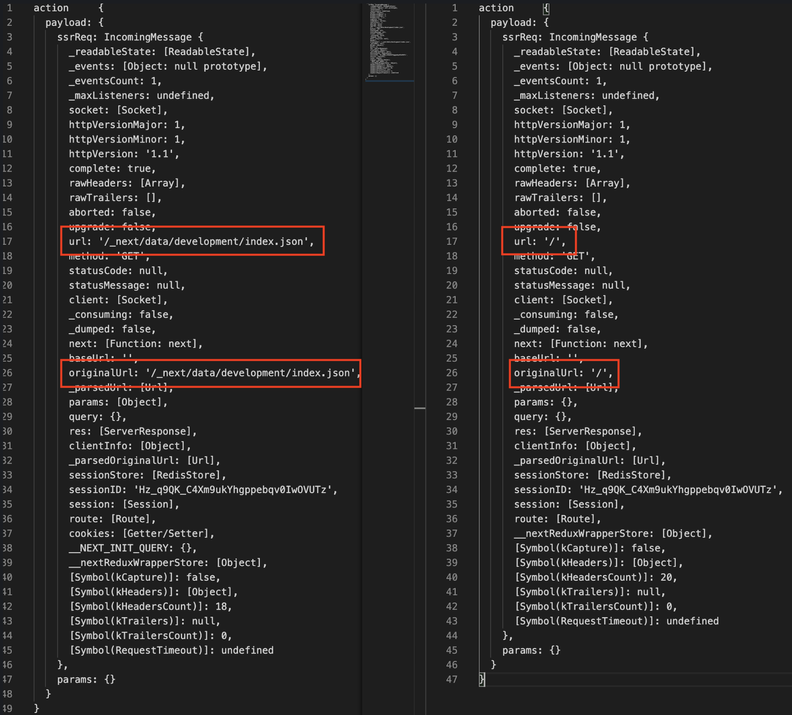

next.js를 처음 사용하며 지속적으로 store에 대해 수정할 부분이 생겼습니다.
심지어 redux도 2016년 이후로 처음 사용하며 (그동안 mobx, mobx-state-tree를 열심히 썼었죠) 공부를 해야했기 때문에 새로운 모듈을
동시다발적으로 많이 추가하게 되었습니다. redux-saga, redux-observable (둘 중 비동기 라이브러리를 어떤걸 쓰느냐 PoC를 진행하며 모두 공부해야 했습니다),
next-redux-wrapper, redux-saga-test-plan...

---

얼마 전, [next-redux-wrapper 에서의 redux-observable 이슈](/posts/next-redux-wrapper)를 공유드리면서
next-redux-wrapper가 next.js에서 해결하려고 했던 부분에 대해 간략히 설명을 드렸었습니다.

바로 `SSR에서 fetch한 데이터를 store에 저장하고, 이를 client와 공유하는 부분`이었죠.

오늘도 열심히 개발을 하다가! 바로 [next-redux-wrapper에서 당황스러운 이슈](https://github.com/vercel/next.js/discussions/15954)에 맞닿게 되었습니다.

(뜬금없지만?! 전 카카오페이에 입사한 이후로 자바스크립트로 프로젝트를 한 경험이 딱 한번 있네요. 물론 이번에도 팀원들에게 열심히 [typescript를 전파](/posts/why-typescript)하였고 (typescript를 쓰지 않고 계셨습니다.) webpack도 직접 다 설정 하는 등, 많은 노력을 기울였습니다.)

## 설정

이 이슈는 제가 typescript를 사용하면서 root store에서 타입을 정의하기 위해 꼼수를 부리다 생긴 이슈였는데요.

```typescript
import {createStore, applyMiddleware, Store} from 'redux';
import {MakeStore, createWrapper, Context} from 'next-redux-wrapper';
import createSagaMiddleware, {Task} from 'redux-saga';
import reducer, {State} from './reducer';
import rootSaga from './saga';

export interface SagaStore extends Store {
  sagaTask?: Task;
}

export const makeStore: MakeStore<State> = (context: Context) => {
  // 1: Create the middleware
  const sagaMiddleware = createSagaMiddleware();

  // 2: Add an extra parameter for applying middleware:
  const store = createStore(reducer, applyMiddleware(sagaMiddleware));

  // 3: Run your sagas on server
  (store as SagaStore).sagaTask = sagaMiddleware.run(rootSaga);

  // 4: now return the store:
  return store;
};

export const wrapper = createWrapper<State>(makeStore, {debug: true});
```

위 코드가 [next-redux-wrapper와 redux-saga를 함께 사용할 때의 root store설정 방법](https://github.com/kirill-konshin/next-redux-wrapper#usage-with-redux-saga)입니다.

```typescript
export type IAppDispatch = typeof rootStore.dispatch;
```

하지만 저는 위와 같이 rootStore의 dispatch값을 타입으로 정의하고 싶었습니다. makeStore에 감싸져 있는 store는 따로 타입으로 정의할 수 없었습니다.
그래서 아래와 같이 store를 조각조각내어 사용하게 되었습니다.

```typescript
...
const sagaMiddleware = createSagaMiddleware();

// dispatch 타입 정의를 위해 setupStore에서 바깥으로 빼냄
const rootStore = configureStore({
  reducer: rootReducer,
  middleware: [
    sagaMiddleware,
    createLogger(true), // in development
  ],
  devTools: true,
});

export const setupStore: MakeStore<IRootState, IRootAction> = () => {
  (rootStore as SagaStore).sagaTask = sagaMiddleware.run(rootSaga);
  return rootStore;
};

const makeStore: MakeStore<IRootState, IRootAction> = (context) => setupStore(context);
const nextReduxWrapper = createWrapper<IRootState>(makeStore, {
  debug: true, // in development
});

export type IAppDispatch = typeof rootStore.dispatch;
export default nextReduxWrapper;
```

당연히 문제는 없어 보입니다. 하나의 함수로 되어있던 root store를 그저 쪼개기만 했으니까요.

---

## 이슈

### 1. 원인

왜 그동안 아무도 이런 이슈를 알아채지 못했을까요?

root store는 환경 설정시 세팅 후, 동작이 잘 되는 한 거의 살펴보지 않게 되는 경향이 있죠. 또한 개발 초기에는 store에 들어간 데이터의 정합성에 대해 크게 신경쓸 필요가 없었을 겁니다. 데이터가 타입대로 잘 들어가지만 하면 된거죠(?!) 대부분 fetch가 주가 되었고, 새로고침을 하더라도 저장되어있는 데이터가 그대로 잘 나타나니 알아차릴 방법이 없었을겁니다.

makeStore 메서드 내에 변수로 존재해야 할 root store를 밖으로 꺼내놨으니, 싱글 스레드인 Node의 store에 저장된 데이터가 지속적으로 유지되고, 새롭게 init되는 과정이 없어진 것이었습니다. 가이드처럼 makeStore를 재구성해주면 해결될 문제인 것으로 판단되었습니다.

fetch가 아닌 post/put/delete의 동작을 실행하게 되니, 바로 이슈를 알아차릴 수 있었... 다면 얼마나 좋았을까요 ㅠㅠ

### 2. 과정

사실 원인에 간단히 써놓은 것과 다르게 원인을 파악하는 데에만 하루정도의 시간이 소요되었습니다.

```
1. nextjs 서비스를 새로 실행한다.
2. 브라우저 접속 시 getServerSideProps를 통해 redux의 action 및 fetch가 실행되고 store에 데이터가 저장된다.
3. 새로고침을 한다.
4. redux action은 실행되지만 업데이트가 안됨
5. 왜???
```

수없이 많은 로그를 남겼으나, 의심가는 곳은 한 두 곳이 아니었습니다.

1. reselect
  - reselect로 가져오는 데이터가 데이터를 캐싱하는걸까?
    - 하지만, client 레벨의 reselect가 새로고침하는 과정까지 데이터를 들고있을 순 없지...
2. next.js

  - 애매하다... 위 이미지와 같은 로그가 생기긴 했는데, 저 url은 언제 바뀐거지..?
  - `/_next/data/development/index.json`에 데이터가 저장되어 있음. 음... 이 로그는 refresh 가 안되나...?
  - 문서에 따로 저장해서 그걸 지속적으로 활용한다는 말이 없음...
```
When you request this page on client-side page transitions through next/link (documentation),
Next.js sends an API request to server, which runs getServerSideProps.
It’ll return a JSON that contains the result of running getServerSideProps,
and the JSON will be used to render the page. (https://nextjs.org/docs/basic-features/data-fetching)
```
3. redux-saga
  - takeLatest, takeEvery 문제?
    - 바꿔바도 문제 없음
    - 문제가 된다면 action 로그도 안찍혔겠지...
4. next-redux-wrapper
  - 음.... 심증만 있고 물증이 없다...

### 3. 해결

역시나 믿을건 구글링 밖에 없었고, 결국 구글링으로 [동일한 이슈를 가진 discussion](https://github.com/vercel/next.js/discussions/15954)을 찾게 되었습니다.

```
The first was that the store that we were using with next-redux-wrapper was defined globally const, instead of internally within makeStore...
```

이슈 해결에 대한 얘기의 바로 첫 문장에서 아차 하는 마음이 들었습니다;; 바로 root store의 global한 store 구성을 제거하였고, 새로고침 시 데이터가 제대로 fetch 됨을 확인할 수 있었습니다.

이를 위해 `IAppDispatch`를 포기하게 되었지만, 사용에 문제가 없었기에 기능을 우선시 할 수밖에 없었습니다.

---

해결에 하루 넘게 걸린 이슈도 막상 해결하고 정리하면 간단하게 끝나지만, 뿌듯함은 이루 말할수가 없네요 :)
