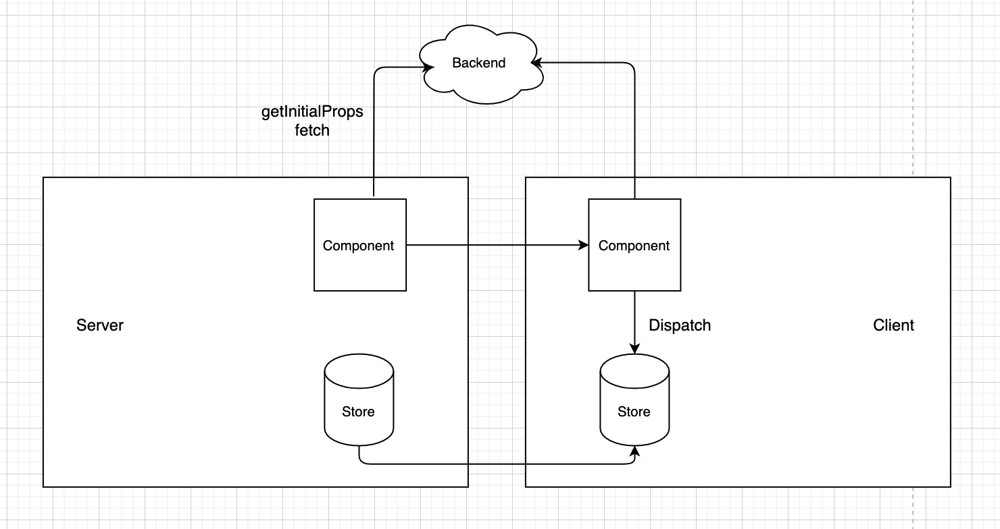
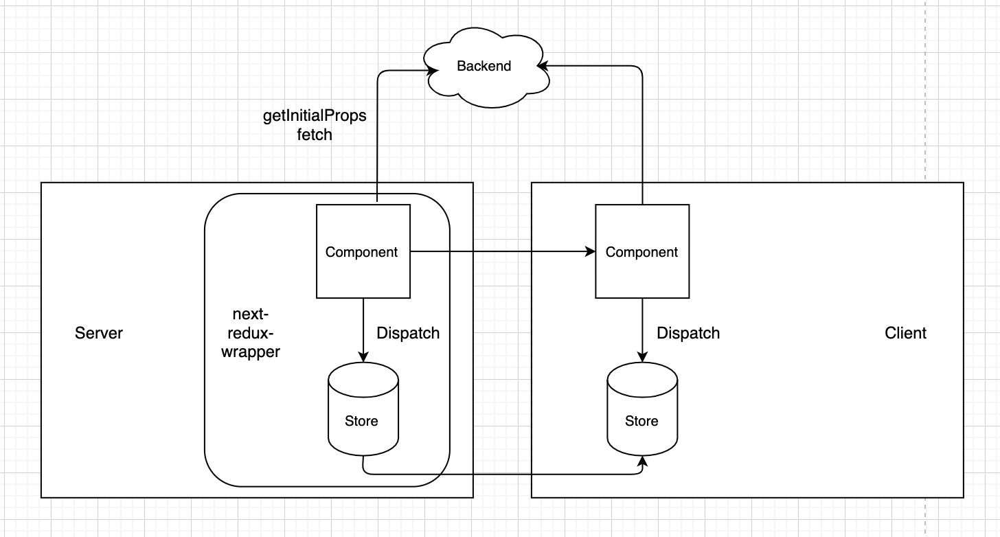
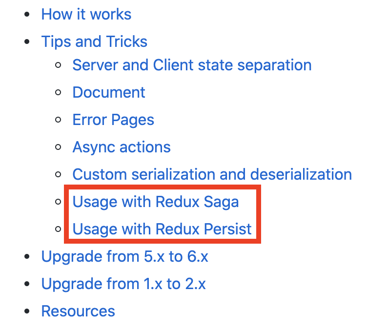
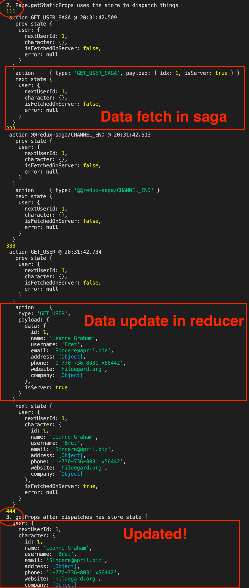
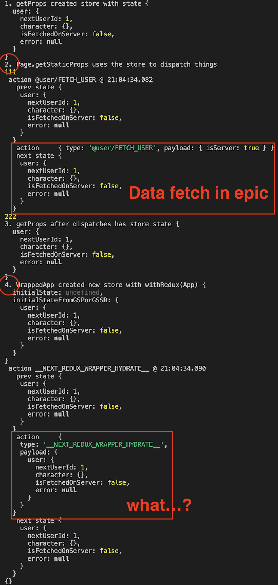

연결된 다음 포스트 : [next-redux-wrapper issue with Redux-observable 2](https://jicjjang.github.io/posts/next-redux-wrapper2)

---

현재 Next.js와 함께 사용하는 skill set은 Redux (observable), Redux toolkit 입니다.
SSR을 위해 Next.js를 사용하고 있는데, [Custom server](https://nextjs.org/docs/advanced-features/custom-server) 코드가 아닌 Component 코드 만으로 최대한 data pre-fetching을 하기 위해 `getInitialProps`를 사용합니다. ([이젠 getServerSideProps, getStaticProps로 사용됨](https://nextjs.org/docs/api-reference/data-fetching/getInitialProps))

```javascript
function Page({ stars }) {
  return <div>Next stars: {stars}</div>
}

Page.getInitialProps = async (ctx) => {
  const res = await fetch('https://api.github.com/repos/vercel/next.js')
  const json = await res.json()
  return { stars: json.stargazers_count }
};

export default Page;
```



이 때, redux를 사용 중이고, `getInitialProps`에서 `dispatch`를 사용해 store를 업데이트를 하려면 어떻게 해야 할까요?

## 간단한 해결책은 [`next-redux-wrapper`](https://github.com/kirill-konshin/next-redux-wrapper) 라이브러리를 사용하는 것입니다.

redux configure에 대한 약간의 설정은 필요하지만, 번거로운 작업 없이 getInitialProps에서 fetch한 데이터를 server side의 store에 저장한 뒤, 이를 client side의 store로 그대로 넘길 수 있습니다.



하지만 문제는, 사용하려고 했던 스펙 중 `Redux-observable`에 대한 support가 이루어지지 않는 부분이었습니다.



support 항목엔 없었지만, [아래 issue의 답변](https://github.com/kirill-konshin/next-redux-wrapper/issues/303)처럼 observable에서도 사용 가능하다는 뉘앙스를 확인할 수 있었습니다.


---

redux-saga와 redux-observable로 PoC를 구성하여 기술적 테스트를 진행하였는데, redux-saga에선 아래와 같이 정상적인 동작이 나왔습니다.



`2. Page.getStaticProps uses the store to dispatch things`가 getInitialProps에서 data fetch하는 action을 실행한 로그입니다. (이후 내부에서 비동기로 update action이 실행 됨) 이후 `3. getProps after dispatches has store state` 로그에서 데이터가 제대로 업데이트 된 모습을 볼 수 있습니다.



하지만 observable에선 `2. Page.getStaticProps uses the store to dispatch things`로그가 나오는 getInitialProps에서 data fetch를 하였으나, `3. getProps after dispatches has store state` 로그에서 데이터가 제대로 들어오지 않은 모습을 볼 수 있습니다. 현재 이미지에는 없으나, Server에서 Client로 store를 넘겨주는 `__NEXT_REDUX_WRAPPER_HYDRATE__` 로그 단계 이후에 Server측 store의 data가 업데이트 되는 로그가 나왔습니다.

---

saga와 observable의 차이는 아래와 같이 rootStore를 구성할 때, 3번 영역처럼 sagaTask를 가진다는점 이었습니다.
하지만 이는 redux-saga자체에서 지원하는 기능으로, redux-observable에선 .run 실행 시, return type이 void 입니다.

```javascript
// store.tsx
...
export interface SagaStore extends Store {
    sagaTask?: Task;
}

export const makeStore: MakeStore<State> = (context: Context) => {
    // 1: Create the middleware
    const sagaMiddleware = createSagaMiddleware();

    // 2: Add an extra parameter for applying middleware:
    const store = createStore(reducer, applyMiddleware(sagaMiddleware));

    // 3: Run your sagas on server
    (store as SagaStore).sagaTask = sagaMiddleware.run(rootSaga);

    // 4: now return the store:
    return store;
};
...

// ------------------------------------------------------------------

// pages/index.tsx
...
export const getServerSideProps = ReduxWrapper.getServerSideProps(
  async ({ store, req, res, ...etc }) => {
    // regular stuff
    store.dispatch(ApplicationSlice.actions.updateConfiguration());
    // end the saga
    store.dispatch(END);
    await store.sagaTask.toPromise(); // sagaTask의 Promise를 기다림
  }
);
...
```

---

현재 [이슈](https://github.com/kirill-konshin/next-redux-wrapper/issues/307)를 남겨 진행 중이지만, Owner가 redux-observable에 대해 대응하는 작업을 진행하지 않았고, 대응 또한 빠르지 않아 근 시일내에 문제를 해결하는 것은 어려워 보입니다.


