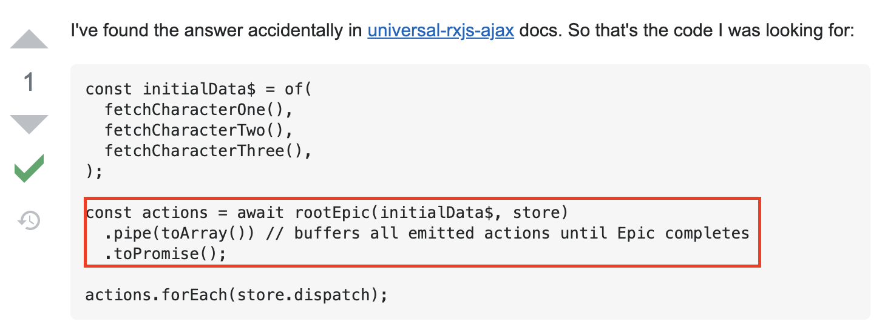

얼마 전에 올렸던 [next-redux-wrapper issue with Redux-observable](https://jicjjang.github.io/posts/next-redux-wrapper) 포스트에 대한 해결책을 찾아
결과를 공유하는 글을 간단~히 준비했습니다.
(매우 짧습니다)

---

[stackoverflow](https://stackoverflow.com/questions/48950278/redux-observable-await-async-actions-and-convert-them-to-promise-using-rootepi)를 열심히 찾다 링크와 같은 내용을 확인했습니다.

`redux-observable을 사용하면서 비동기 통신 후, dispatch에 대한 싱크가 맞지 않는다` 라는 문의의 답변으로 아래와 같이 `rootEpic에 대해 toPromise를 추가해라` 라는 내용이었고, saga에서의 `await store.sagaTask.toPromise();` 문구와 유사하다고 느꼈습니다.



그래서 해당 부분을 개발 코드에 적용해 보기로 하였고, 로직 자체에 대한 레퍼런스가 없어 100퍼센트 이해하진 못하였으나, 문제가 해결되는 것을 볼 수 있었습니다.

---

조금 특이하게, dispatch에 action을 넣는 방식이 아니라 각 action에 dispatch를 넣는 방식으로 돌아가는 구조였습니다.
(이 부분에 대한 이해가 100프로가 되지 않습니다.)

```tsx
export const getServerSideProps = wrapper.getServerSideProps(async context => {
  console.log('2. Page.getStaticProps uses the store to dispatch things');

  /**
   * @issue
   * user/epics파일의 fetchUserEpic함수 return 타입을 UserEpic으로 잡으면, of()에 모든 Action을 넣으라는 에러가 나게 됨.
   */
  const initialData$ = of(fetchUserAction()); // 1. toPromise를 적용할 초기 비동기 함수를 넣음
  const actions = await rootEpic(initialData$, rootStore).pipe(toArray()).toPromise(); // 2. initialData actions에 toPromise를 적용함
  actions.forEach(context.store.dispatch); // 3. actions를 반복하며 dispatch를 적용함

  console.log('2. the end');
});
```

기존에 올렸던 포스트의 `전반적인 store 세팅을 진행하는` store.tsx에서 달라지는 부분이 없엇고,

```tsx
// redux-saga => store.tsx
...
export interface SagaStore extends Store {
    sagaTask?: Task;
}

export const makeStore: MakeStore<State> = (context: Context) => {
    // 1: Create the middleware
    const sagaMiddleware = createSagaMiddleware();

    // 2: Add an extra parameter for applying middleware:
    const store = createStore(reducer, applyMiddleware(sagaMiddleware));

    // 3: Run your sagas on server
    /*
    * @IMPORTANT 중요한 건 이부분!!! 이 부분이 observable에 없음. 없는 그대로 진행
    */
    (store as SagaStore).sagaTask = sagaMiddleware.run(rootSaga);

    // 4: now return the store:
    return store;
};
...
```

reducer 또한 마찬가지로, 기존 redux-saga에서와 동일하게 `action.type === HYDRATE` 구문이 추가되는 것이 동일합니다.

```tsx
// reducer.tsx
const rootReducer = (state: any, action: RootActionType) => {
  if (action.type === HYDRATE) {
    return {
      ...state,
      ...action.payload
    };
  } else {
    return combinedReducer(state, action);
  }
};
```

---

해당 PoC를 진행하면서 typesafe-actions 에서 redux-toolkit을 사용하기로 결정되었기에 PoC 또한 이를 변경하는 작업을 함께 진행하였는데요! 결국 핵심적으로 바뀐 부분은 위와 같이 getInitialProps (getStaticProps, getServerSideProps) 부분이었습니다.

약간의 문제로 보자면, typesafe-actions에서 redux-toolkit으로 교체하며 action들에 대한 type을 typesafe-actions 대비 redux-toolkit이 제대로 지원해주지 못하고 있습니다. (애초에 redux-thunk만 정식 지원이긴 합니다... [create async thunk...](https://redux-toolkit.js.org/usage/usage-with-typescript#createasyncthunk)너무 thunk만 지원을... ㅠㅠ)

결론적으로 typesafe-actions를 지우지 못하고, type을 뽑아오는 부분에서만 사용하고 있습니다. 이 부분에 대해 좋은 방법을 아시고 계신 분은 알려주시면 감사하겠습니다!! ㅎㅎ