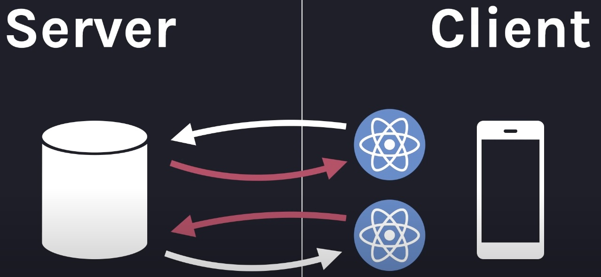
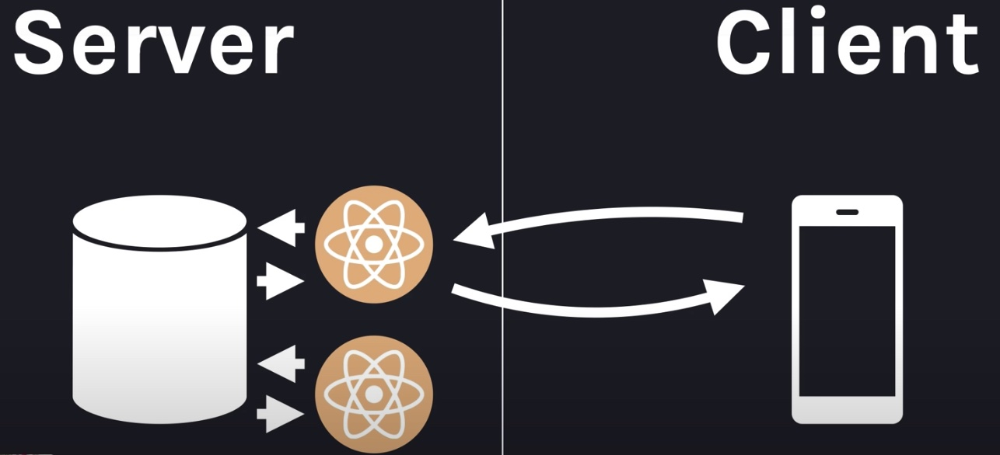
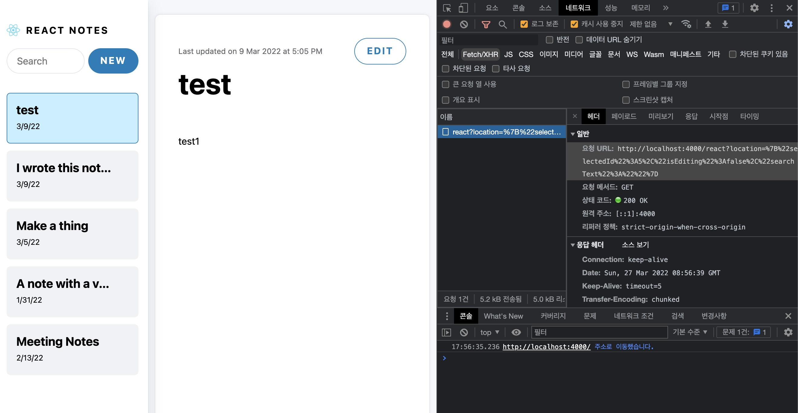

이미 발표는 애진작에(?) 되었지만 아직 발표는 더디기만 한 react-server-component(이하 rsc)에 대해 알아보겠습니다.

---

# 설명

첫 발표는 20년 12월에 되었습니다. 그 당시 next.js를 막 사용하기 시작하던 때라 rsc에는 큰 관심이 없었습니다.
하지만 next.js 프로젝트가 끝나고 유지보수를 하면서 프레임워크 자체 무게로 인해 생각했던 것보다
(성능적인 부분까지 체크하진 않았으나) 노출되는 속도라던지 반응속도가 느리게 느껴졌습니다. 이런 생각을 저만 했다면 server-side-rendering(이하 ssr)에서
더 큰 발전 방향을 생각하지 못했을지 모릅니다.

rsc란 뭘까요? 말 그대로 component를 서버에서 불러온다는 의미의 server component입니다.
그 구조는 아래와 같습니다.



기존의 client-side-rendering(이하 csr)은 위와 같이 서버와 통신했습니다. 처음 client에서 호출이 들어오면 서버에서 static 파일들을 보내주고, client에서 데이터를 fetch하면 데이터를 보내주고.

ssr은 어떨까요? 구조는 위 csr과 동일합니다. 그 대신 처음에 client에서 호출이 들어올 때, 초기 구성 데이터를 호출해 static 파일들과 같이 내려주는 방식인 것이죠.

rsc는 왜 데이터만 내려보내줘? 라는 것에 의문을 둔 것이죠



데이터와 react component를 합쳐 클라이언트로 내려주는 것입니다. 브라우저에서 static 파일을 불러오고 dom을 구성하기 위한 react 관련 파일, library를 불러오는 것 대신 서버에서 react에서 compile된 직렬화 데이터를 내려주기 때문에 리소스 측면에서, 속도 측면에서 모두 이점을 가지게 됩니다.

# 동작

파일명을 `*.server.jsx`, `*.client.jsx` 로 잡으면 react가 런타임 시 잡아주게 됩니다. (bundler의 설정이 필요할 수 있음) 따라서 파일명에 따라 간단하게 특정 페이지는 rsc, 특정 페이지는 csr을 하는 등의 구성을 가질 수 있게 됩니다.

눈치 채신 분들도 있으시겠지만, client파일 내에 server 파일을 import할 수 없습니다. 반대의 경우는 물론 가능합니다.
또한 server파일은 직렬화 해서 client로 내려가기 때문에 함수나 이벤트와 같은 내용은 client로 전달할 수 없습니다.

현재 설정이 쉽지 않아 React 측에서도 shofify와 next.js에서 해당 기능을 만들면 해당 기능을 사용하라고 권장하고 있습니다. 해당 post에서는 기본적인 동작만 알아보겠습니다.

React에 올라왔던 rsc 문서 [https://reactjs.org/blog/2020/12/21/data-fetching-with-react-server-components.html](https://reactjs.org/blog/2020/12/21/data-fetching-with-react-server-components.html)와 해당 문서의 영상에서 설명해주는 [demo link](http://github.com/reactjs/server-components-demo) 의 코드를 바탕으로 확인해보겠습니다.

처음 프로젝트를 시키는 명령어인 `npm start` 명령어부터 따라가 봅시다.
server 실행을 위해 `nodemon -- --conditions=react-server server`, client 번들링을 위해 위해 `nodemon -- scripts/build.js`을 하고 있습니다.

## 동작 - client

client부터 보자면

1. `build/index.html`에서 main.js를 호출합니다.
2. 최하단에 아래와 같은 코드로 entry point가 index.client.js 라는 것을 알 수 있습니다.
```js
/************************************************************************/
/******/ 	
/******/ 	// startup
/******/ 	// Load entry module and return exports
/******/ 	// This entry module is referenced by other modules so it can't be inlined
/******/ 	var __webpack_exports__ = __webpack_require__("./src/index.client.js");
/******/ 	
/******/ })()
;
//# sourceMappingURL=main.js.map
```
3. Root.client.js가 실행합니다. (여기서 해당 bootstrap의 페이지 자체 렌더링은 csr로 돌리고 있음을 알 수 있음)
4. Root.client.js 안에서 Content 함수를 호출합니다.
```jsx
function Content() {
  const [location, setLocation] = useState({
    selectedId: null,
    isEditing: false,
    searchText: '',
  });
  const response = useServerResponse(location); // server와 관련된 일을 함을 알 수 있음
  return (
    <LocationContext.Provider value={[location, setLocation]}>
      {response.readRoot()}
    </LocationContext.Provider>
  );
}
```
5. cache는 말 그대로 호출된 rsc 데이터를 저장하는 역할인데, location이란 param을 받아 서버에서 데이터를 받고 cache에 저장합니다.
```js
export function useServerResponse(location) {
  const key = JSON.stringify(location);
  const cache = unstable_getCacheForType(createResponseCache);
  let response = cache.get(key);
  if (response) {
    return response;
  }
  response = createFromFetch(
    fetch('/react?location=' + encodeURIComponent(key));
  );
  cache.set(key, response);
  return response;
}
```
server 코드를 확인하기 전에 브라우저에서 `/react?location=` 이 어떻게 실행되는지 확인해봅시다.


키워드 하나를 클릭했더니 param은 `location: {"selectedId":5,"isEditing":false,"searchText":""}` 이와 같이 들어왔습니다.

결과는 아래와 같습니다.
```
M1:{"id":"./src/SearchField.client.js","chunks":["client5"],"name":""}
M2:{"id":"./src/EditButton.client.js","chunks":["client1"],"name":""}
S3:"react.suspense"
J0:["$","div",null,{"className":"main","children":[["$","section",null,{"className":"col sidebar","children":[["$","section",null,{"className":"sidebar-header","children":[["$","img",null,{"className":"logo","src":"logo.svg","width":"22px","height":"20px","alt":"","role":"presentation"}],["$","strong",null,{"children":"React Notes"}]]}],["$","section",null,{"className":"sidebar-menu","role":"menubar","children":[["$","@1",null,{}],["$","@2",null,{"noteId":null,"children":"New"}]]}],["$","nav",null,{"children":["$","$3",null,{"fallback":["$","div",null,{"children":["$","ul",null,{"className":"notes-list skeleton-container","children":[["$","li",null,{"className":"v-stack","children":["$","div",null,{"className":"sidebar-note-list-item skeleton","style":{"height":"5em"}}]}],["$","li",null,{"className":"v-stack","children":["$","div",null,{"className":"sidebar-note-list-item skeleton","style":{"height":"5em"}}]}],["$","li",null,{"className":"v-stack","children":["$","div",null,{"className":"sidebar-note-list-item skeleton","style":{"height":"5em"}}]}]]}]}],"children":"@4"}]}]]}],["$","section","5",{"className":"col note-viewer","children":["$","$3",null,{"fallback":["$","div",null,{"className":"note skeleton-container","role":"progressbar","aria-busy":"true","children":[["$","div",null,{"className":"note-header","children":[["$","div",null,{"className":"note-title skeleton","style":{"height":"3rem","width":"65%","marginInline":"12px 1em"}}],["$","div",null,{"className":"skeleton skeleton--button","style":{"width":"8em","height":"2.5em"}}]]}],["$","div",null,{"className":"note-preview","children":[["$","div",null,{"className":"skeleton v-stack","style":{"height":"1.5em"}}],["$","div",null,{"className":"skeleton v-stack","style":{"height":"1.5em"}}],["$","div",null,{"className":"skeleton v-stack","style":{"height":"1.5em"}}],["$","div",null,{"className":"skeleton v-stack","style":{"height":"1.5em"}}],["$","div",null,{"className":"skeleton v-stack","style":{"height":"1.5em"}}]]}]]}],"children":"@5"}]}]]}]
M6:{"id":"./src/SidebarNote.client.js","chunks":["client6"],"name":""}
J4:["$","ul",null,{"className":"notes-list","children":[["$","li","5",{"children":["$","@6",null,{"id":5,"title":"test","expandedChildren":["$","p",null,{"className":"sidebar-note-excerpt","children":"test1"}],"children":["$","header",null,{"className":"sidebar-note-header","children":[["$","strong",null,{"children":"test"}],["$","small",null,{"children":"3/9/22"}]]}]}]}],["$","li","4",{"children":["$","@6",null,{"id":4,"title":"I wrote this note today","expandedChildren":["$","p",null,{"className":"sidebar-note-excerpt","children":"It was an excellent note."}],"children":["$","header",null,{"className":"sidebar-note-header","children":[["$","strong",null,{"children":"I wrote this note today"}],["$","small",null,{"children":"3/9/22"}]]}]}]}],["$","li","3",{"children":["$","@6",null,{"id":3,"title":"Make a thing","expandedChildren":["$","p",null,{"className":"sidebar-note-excerpt","children":"It's very easy to make some words bold and other words italic with Markdown. You can even link to React's..."}],"children":["$","header",null,{"className":"sidebar-note-header","children":[["$","strong",null,{"children":"Make a thing"}],["$","small",null,{"children":"3/5/22"}]]}]}]}],["$","li","2",{"children":["$","@6",null,{"id":2,"title":"A note with a very long title because sometimes you need more words","expandedChildren":["$","p",null,{"className":"sidebar-note-excerpt","children":"You can write all kinds of amazing notes in this app! These note live on the server in the notes..."}],"children":["$","header",null,{"className":"sidebar-note-header","children":[["$","strong",null,{"children":"A note with a very long title because sometimes you need more words"}],["$","small",null,{"children":"1/31/22"}]]}]}]}],["$","li","1",{"children":["$","@6",null,{"id":1,"title":"Meeting Notes","expandedChildren":["$","p",null,{"className":"sidebar-note-excerpt","children":"This is an example note. It contains Markdown!"}],"children":["$","header",null,{"className":"sidebar-note-header","children":[["$","strong",null,{"children":"Meeting Notes"}],["$","small",null,{"children":"2/13/22"}]]}]}]}]]}]
J5:["$","div",null,{"className":"note","children":[["$","div",null,{"className":"note-header","children":[["$","h1",null,{"className":"note-title","children":"test"}],["$","div",null,{"className":"note-menu","role":"menubar","children":[["$","small",null,{"className":"note-updated-at","role":"status","children":["Last updated on ","9 Mar 2022 at 5:05 PM"]}],["$","@2",null,{"noteId":5,"children":"Edit"}]]}]]}],["$","div",null,{"className":"note-preview","children":["$","div",null,{"className":"text-with-markdown","dangerouslySetInnerHTML":{"__html":"<p>test1</p>\n"}}]}]]}]
```

(추가적으로 여러 시도를 해봤더니 아래와 같은 param이 들어옴을 알 수 있었습니다)
```js
location: {"selectedId":null,"isEditing":true,"searchText":""} // new
location: {"selectedId":5,"isEditing":true,"searchText":""} // edit
location: {"selectedId":5,"isEditing":true,"searchText":"as"} // edit + search
location: {"selectedId":1,"isEditing":false,"searchText":""} // choose other note
```

잠깐 둘러보더라도 서버에서 react를 compile한 결과의 정보들을 나열해놓은 것이라 여겨집니다.
그렇다면 이제 해당 코드가 어떻게 나오게 되는지 server쪽을 확인해보겠습니다.

## 동작 - server

server 디렉토리의 package.json의 main property는 `./api.server.js` 로 가지고 있으니 해당 파일로 실행이 됩니다.

1. client 1번에서 `build/index.html`이 실행된다고 했는데 78L에 해당 내용이 있습니다.
```js
app.get(
  '/',
  handleErrors(async function(_req, res) {
    await waitForWebpack();
    const html = readFileSync(
      path.resolve(__dirname, '../build/index.html'),
      'utf8'
    );
    res.send(html);
  })
);
```

2. 그 다음 우리가 궁금한 `/react?locaiton=` 이 어떻게 나오는지 확인해보겠습니다.

```js
async function renderReactTree(res, props) {
  await waitForWebpack();
  const manifest = readFileSync(
    path.resolve(__dirname, '../build/react-client-manifest.json'),
    'utf8'
  );
  const moduleMap = JSON.parse(manifest);
  const {pipe} = renderToPipeableStream(
    React.createElement(ReactApp, props),
    moduleMap
  );
  pipe(res);
}

function sendResponse(req, res, redirectToId) {
  const location = JSON.parse(req.query.location);
  if (redirectToId) {
    location.selectedId = redirectToId;
  }
  res.set('X-Location', JSON.stringify(location));
  renderReactTree(res, {
    selectedId: location.selectedId,
    isEditing: location.isEditing,
    searchText: location.searchText,
  })
}

app.get('/react', function(req, res) {
  sendResponse(req, res, null);
});
```

sendResponse에서 location에 대해 spread하여 `renderReactTree로` 넘기는 것을 보니, 실제 서비스에 rsc를 적용한다면 기능별 rsc endpoint가 나뉠수도 있을 것으로 예상해볼 수 있습니다.

아마 return을 하지 않아도 제일 마지막 stack인 `renderReactTree`의 `pipe(res)`까지 response를 넘기는 것을 보니, res에 값을 싣는 과정이 pipe에 들어가 있을 것 같습니다.

결국 모든 기능은 `renderReactTree` 함수 내부의 `renderToPipeableStream` 기능이 하는 것입니다. `React.createElement(ReactApp, props)` 

`ReactApp`와 `props`를 서버에서 compile하고 pipe를 통해 res에 싣는 것이죠.

bootstrap 코드를 따라가보니 그나마 쉽게 이해할 수 있었습니다.
마지막으로 하나 더 볼 부분은 webpack입니다.

처음에 `npm run bundler:dev` 가 실행됨을 말씀드렸는데 webpack plugin에 아래와 같은 코드가 있습니다. isServer는 아직 의미가 없네요^^;

```js
new ReactServerWebpackPlugin({isServer: false})
// node_modules/react-server-dom-webpack/cjs/react-server-dom-webpack-plugin.js#L55
// if (options.isServer) {
//   throw new Error('TODO: Implement the server compiler.');
// }
```

---

이렇게 간단하게 주요한 rsc 로직에 대해서만 demo 코드 기준으로 알아보았습니다. (node crud 코드는 생략) 컨셉은 좋지만, SSR을 프레임워크 없이 사용했던 경험과 유사한 복잡도지 않나 생각이 드네요. shofify에서는 이미 [해당 기능을 추가](https://shopify.dev/custom-storefronts/hydrogen/framework/react-server-components/work-with-rsc)해놨고, next.js에서도 [demo를 열심히 작업](https://github.com/vercel/next-react-server-components)하는 것을 보니 한창 작업 중인 것으로 예상됩니다.

FE개발자는 트렌트가 바뀔때마다 바빠지는데 앞으로 또 어떻게 바빠지고 재밌어질 지 궁금하네요.
