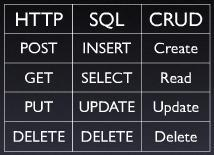

인턴 생활이 끝나고 다시 혼자 공부를 시작하면서 시간적 여유가 생겨 블로그를 다시 시작하게 되었습니다.
오늘 알아보고자 하는 내용은 "RESTful" 입니다.

바쁜 와중에 'rest란 이런내용이야' 하고 살짝 맛만 본 상태라 자세히 알아보기로 했습니다.

`Roy Fielding의 2000년 박사논문에서 소개되었다.`
`Roy Fielding은 HTTP의 주요 저자 중 한 사람이다.`
`이 개념은 네트워킹 문화에 널리 퍼졌다.... (wiki)`

REST(Representaional State Transfer)는 웹 프로토콜(HTTP)을 활용하여, 네트워크 기반 Resource 인터페이스를 제안했습니다. 이미 SOAP이라는 규약이 있었으나,
복잡함 때문에 사용자들이 REST를 더 많이 사용하고 있습니다. 한마디로 REST는 URI + HTTP Method 입니다.

`URI = Resource, HTTP Method = Action`

자세히 설명을 해보자면,

- URL에 모든 Resource를 표현함.
- CRUD를 이용해 Action을 표현함.

REST의 가장 큰 특징중의 하나가 모든 자원을 Resource로 표현한다는 것인데, 이 말은 Resource가 HTTP URL에 의해서 표현되는 것입니다. 예를 들어 제 블로그의
articles 안의 web-presentation 게시글을 보려면 [https://jicjjang.github.io/posts/web-presentation](/posts/web-presentation) 로,
URI 뒤에 articles/web-presentation으로 들어가야 합니다. 이는 REST가 ROA를 따르는 웹 서비스이기 때문입니다.

CRUD란 create, read, update, delete의 모음으로 HTTP Method 인 GET, POST, PUT, DELETE로 이를 제어합니다.

1. https://example.com/user/jicjjang 의 GET Method로 불러온 페이지는 Read (사용자 정보 조회)
2. https://example.com/user/jicjjang 의 POST Method로 불러온 페이지는 Create (사용자 정보 생성)
3. https://example.com/user/jicjjang 의 PUT Method로 불러온 페이지는 Update (사용자 정보 추가)
4. https://example.com/user/jicjjang 의 DELETE Method로 불러온 페이지는 Delete (사용자 정보 삭제)

현재 HTTP Method는 더 많으나, CRUD만으로 모든 행위를 표현할 수 없고, URL로 표현할 때에도 문맥상 문제가 발생하는 경우가 많습니다.

REST는 기존 HTTP를 변환없이 그대로 쓸 수 있으므로 사용에 어려움도 없습니다. 그저 조금 더 CRUD와 RESTful함을 생각하며 설계를 해 나가면 됩니다.

REST는 쓰기 쉽고, 이해하기도 쉬우므로 네트워크 및 웹 서비스 사용자들이 많이 사용하고 있다는 장점이 있습니다. 하지만 표준이 아니라 관리가 어렵다는 점이 단점으로 계속 남아있습니다.

---

2000년대에 발표된 논문을 토대로 나온 이론에, 표준 아닌 표준으로 자리잡아 많은 사용자들이 있는 시점에서도 표준으로는 SOAP가 자리잡고 있습니다.
블로그 글을 쓰기 전에도 자료를 찾으면서도 REST에 대한 충분한 자료들이 많이 있다는 것을 느꼈습니다.
개인적으로 REST가 표준으로 자리잡기 전에 아마 새로운 표준이 나오지 않을까... 하는 생각도 들었습니다.

포스팅을 마무리하겠습니다.
